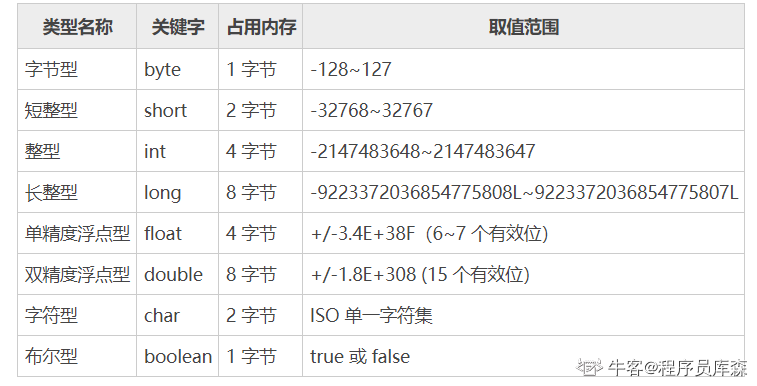
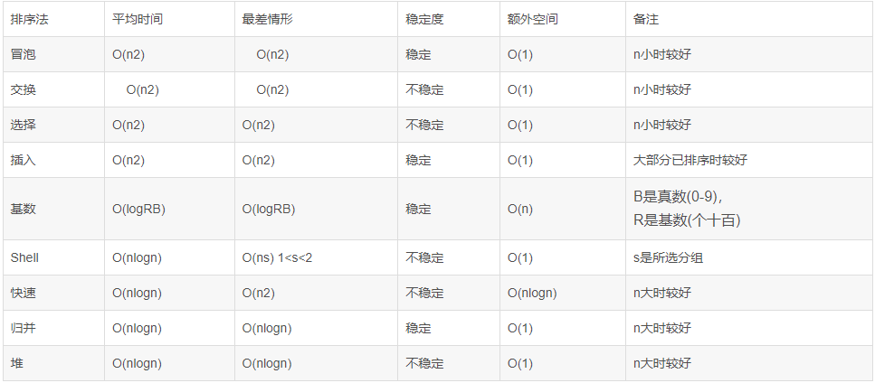
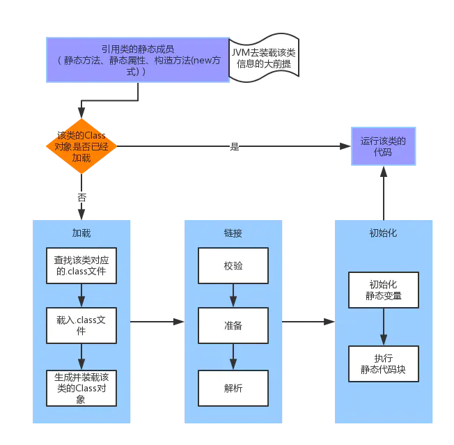
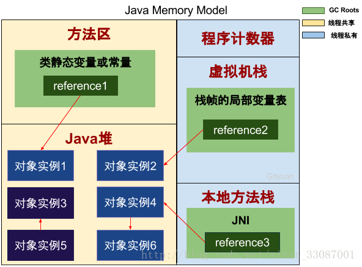
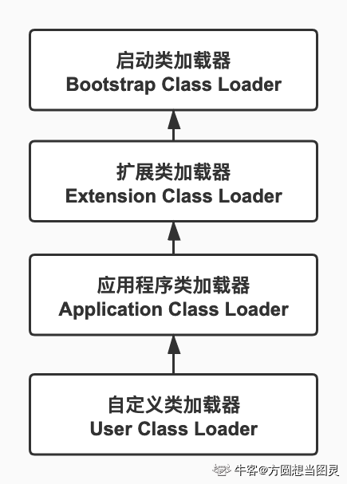
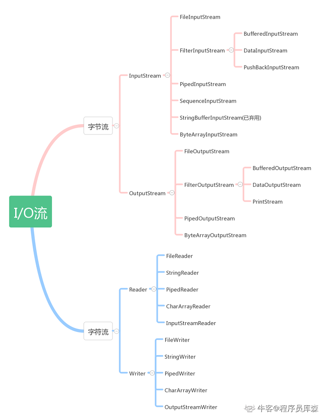
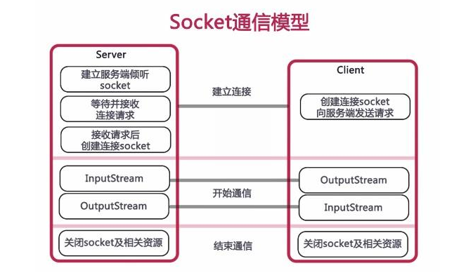
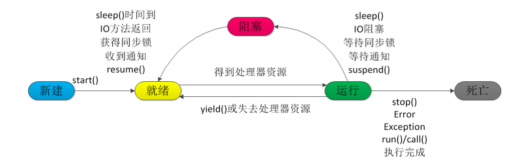
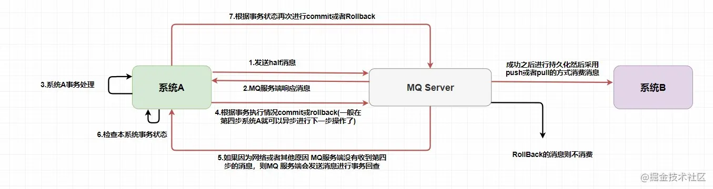
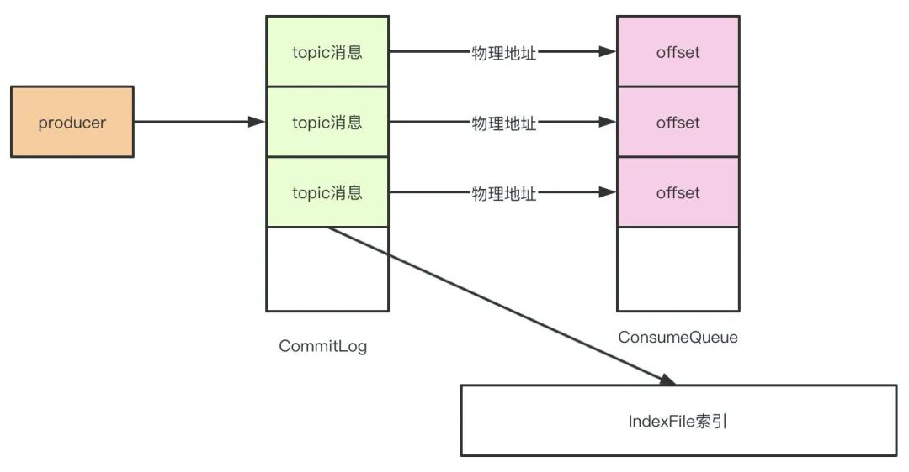

# Java基础


## 1、JVM、JRE和JDK的关系是什么

JDK是功能齐全的Java SDK。它拥有JRE所拥有的一切，还有编译器(javac)和工具(javadoc和jdb)。它能够创建和编译程序。

JRE是Java Runtime Environment的缩写，是运行已编译Java程序所需的所有内容的集合，包括Java虚拟机(JVM)，Java类库，Java命令和其他一些基础构件。但是它不能用于创建新程序。

JVM是Java Vrtual Machine的缩写，是运行Java字节码的虚拟机，针对不同的系统有特定的实现。目的是使用相同的字节码，它们都会给出相同的结果。


### Java基本数据类型





### 面向对象三大特性

- 封装。封装最好理解了。封装是面向对象的特征之一，是对象和类概念的主要特性。封装，也就是把客观事物封装成抽象的类，并且类可以把自己的数据和方法只让可信的类或者对象操作，对不可信的进行信息隐藏提高了数据的隐秘性的同时，使代码模块化，这样做使得代码的复用性更高。
- 继承。继承是指这样一种能力：它可以使用现有类的所有功能，并在无需重新编写原来的类的情况下对这些功能进行扩展。通过继承创建的新类称为“子类”或“派生类”，被继承的类称为“基类”、“父类”或“超类”。这样做扩展了已存在的代码块，进一步提高了代码的复用性。
- 多态性。多态就是指程序中定义的引用变量所指向的具体类型和通过该引用变量发出的方法调用在编程时并不确定，而是在程序运行期间才确定，即一个引用变量到底会指向哪个类的实例对象，该引用变量发出的方法调用到底是哪个类中实现的方法，必须在由程序运行期间才能决定。因为在程序运行时才确定具体的类，这样，不用修改源程序代码，就可以让引用变量绑定到各种不同的类实现上，从而导致该引用调用的具体方法随之改变，即不修改程序代码就可以改变程序运行时所绑定的具体代码，让程序可以选择多个运行状态，这就是多态性。多态的一大作用就是为了**解耦**，它是指在父类中定义的属性和方法被子类继承之后，可以具有不同的数据类型或表现出不同的行为，这使得同一个属性或方法在父类及其各个子类中具有不同的含义。


## 2、Java类加载过程



**加载**：

1. 通过全类名获取定义此类的二进制字节流
2. 将字节流所代表的静态结构转换为方法区的运行时数据结构
3. 在内存中生成一个代表该类的Class对象，作为方法区这些数据的访问入口

**验证**：文件格式验证、元数据验证、字节码验证、符号引用验证,检查加载的class文件的正确性;
**准备**：给类中的静态变量分配内存空间并设置静态变量初始值(数据类型默认值)；
**解析**：虚拟机将常量池中的符号引用替换成直接应用的过程，**符号引用**用一组符号来描述所引用的目标，**直接引用**就是直接指向内存中的地址；
**初始化**：对静态变量和静态代码块执行初始化工作；


### Java内存区域

**程序计数器**：当前线程的字节码行号指示器，字节码解释器的工作就是通过改变计数器的值来来选取下一条需要执行的字节码指令，它是程序控制流的指示器，分支、循环、跳转、异常处理、线程恢复等基础功能都需要依赖这个计数器来完成
线程私有，没有OutOfMemoryError情况 

**Java虚拟机栈**：Java方法执行的线程内存模型，每个方法被执行的时候，Java虚拟机都会创建一个栈帧用于存储局部变量表，操作数栈，动态链接、方法出口等信息
局部变量表中存储的是基本数据类型，对象的引用和returnAddress类型
线程私有，生命周期与线程相同
如果线程请求的栈深度大于虚拟机所允许的深度，会发生StackOverflowError，若栈容量支持动态扩展，那么可以发生OutOfMemoryError情况，在HotSpot虚拟机中不会发生OutOfMemoryError 

**本地方法栈**：为被native修饰的方法提供服务，与虚拟机栈类似 

Java堆：所有对象实例以及数组都在堆上分配内存，也是垃圾回收器主要管理的内存区域
被所有线程共享的一块区域，当堆内存不够用时，会抛出OutOfMemoryError 

**方法区**
用于储存被虚拟机加载的：类型信息、常量、静态变量、即时编译器编译后的代码缓存等数据；在JDK1.8采用元空间来实现
也是线程共享的区域，垃圾回收主要针对常量池的回收和类型卸载，但是类型卸载比较苛刻
当方法区无法满足内存分配需求时，将会抛出OutOfMemoryError




- 如何产生OutOfMemory？
  堆内存不够用了，会抛出这个OutOfMemoryError 

- 你能用什么方法来抛出这个Error？
  可以通过把堆内存通过参数-Xmx调小一些，然后写一个while的死循环，不断的执行append操作 

- 那如何产生Stack Overflow Error？
  这个是栈溢出，我们可以通过写两个方法，A方法调用B方法，B方法在调用A方法，这样可以产生这个Error 

- 你还知道其他的JVM参数嘛？
  知道，-Xms指定堆的初始大小，-Xss指定栈的大小，-XX:+HeapDumpOnOutOfMemoryError内存快照的Dump文件，可以分析Dump文件来查看OutOfMemoryError

**JDK1.8发生的变化**

移除方法区

　　JDK 1.7及之前方法区存放的数据有**类信息**（类名，修饰符，字段描述，方法描述等），**常量**，**静态变量**，**即时编译后的class文件**。

　　方法区中还包含有常量池：常量池中主要有字面量和符号引用

　　　字面量：文本字符串，声明为final的常量值；

　　　符号引用：包括了三种常量，分别是：类和接口的全限定名，字段的名称和描述符，方法的名称和修饰符。

MetaSpace元空间 取而代之

　　JDK 1.8将方法区中的**字符串常量移至堆内存，其他内容如类信息、静态变量、其他常量（如整形常量），即时编译后的class文件等都移动到元空间内**。

　　元空间（MetaSpace）不在堆内存上，而是直接占用的本地内存。因此元空间的大小仅受本地内存限制。也可通过参数来设定元空间的大小

## 3、Java类卸载

卸载类即该类的对象被GC。

需要满足3个要求该类才会被卸载：

1. 该类的所有实例对象都已经被GC。
2. 该类对应的Class对象没有在其他地方被引用。
3. 加载该类的类加载器已经被回收。


## 4、Maven的作用

1. Maven可以统一管理所有的依赖jar包，不需要程序员再去寻找
2. 对第三方组件用到的共同jar包，Maven自动解决重复和冲突问题
3. Maven可以统一每个项目的构建过程，实现不同项目的兼容性管理

Maven查看依赖树命令：`mvn dependency:tree`


## 5、final 、 finally 、 finalize三个关键字的区别

1. final可以修饰类、变量、方法，修饰类表示该类不能被继承、修饰方法表示该方法不能被重写、修饰变量表示该变量是一个常量不能被重新赋值。
2. finally一般作用在try-catch代码块中，在处理异常的时候，通常我们将一定要执行的代码放在finally代码块中，表示不管是否出现异常，该代码块都会执行，一般用来存放一些关闭资源的代码。
3. finalize是一个方法，属于Object类的一个方法，而Object类是所有类的父类，该方法一般由垃圾回收器来调用，当我们调用System的gc()方法的时候，由垃圾回收器调用finalize(), 回收垃圾。 


## 6、ReentrantLock实现原理

**ReentrantLock**是一把**可重入的排它锁**。多线程下，可以保证只有一个线程获取该锁，如果该线程已经获取锁，并且重新尝试获取该锁是可以成功获取的。主要用途就是为共享资源提供同步访问的作用。

使用例子：new 一个ReentrantLock 实例，然后调用**lock**方法获取锁，使用完毕调用unlock方法释放该锁。这样就保证lock 和 unlock 之间的代码块是同步访问的。如图所示：

```java
ReentrantLock lock = new ReentrantLock();
lock.lock();
try{
    //同步代码块
    
}finally{
    lock.unlock();
}
```

> 释放锁一定要放在try-catch的finally语句里，否则容易出现无法释放锁，导致其他线程一直阻塞无法获取该锁

**ReentrantLock**整个锁的实现都是通过委托给静态内部抽象类**Sync**实现。抽象类**Sync**分别又有**公平锁(FairSync)**和**非公平锁(NonfairSync)**的实现类。通过**ReentrantLock**构造函数参数来指定使用公平锁还是非公平锁。

- 多线程下保证只有一个线程获取到锁

  锁的实现都是委托给**Sync**静态类实现的，它继承了**AQS**类。AQS类中维护了一个同步状态int型变量**state**，默认值为0。当线程获取锁的时候，就通过**Unsafe**提供的CAS方法，修改state值为1，修改成功就获取该锁，修改失败就获取失败。

- 当锁已经被一个线程获取，其他线程获取锁失败时的处理方法

  当获取锁失败，AQS中提供了一个FIFO的等待队列。把获取失败的线程封装成一个节点，然后插入等待队列中，同时把该线程设置成阻塞状态。

- 当锁被释放时，通知其他线程继续竞争锁的实现方法

  当锁释放后，唤醒等待队列中的第一个线程，然后该线程重新通过CAS来竞争锁。如果获取成功，则从等待队列中删除，如果获取失败，继续保持在等待队列中，等待下次唤醒。

**公平锁原理：**AQS维护了一个先进先出的等待队列，只要等待队列中有等待的线程，则新来的尝试获取锁的线程都插入等待队列中。这样保证之前的等待队列先获取该锁。

**非公平锁原理：**当锁被释放后，还未进去等待队列的线程和在等待队列中唤醒的线程可同时竞争获取该锁。这样刚来竞争的线程可能就获取到锁，而等了很久的线程依然没有获取。这就是不公平的地方。这种方式性能好，刚来的线程少了阻塞和唤醒。


## 7、公平锁和非公平锁，如何实现

**公平锁/非公平锁：**当多个线程获取锁的时候，按照规则排队等待即为公平锁，不按照规则排队的即为非公平锁。

**ReentrantLock**通过传入的参数来决定是否使用公平锁，参数为true公平锁，默认使用非公平锁。**Synchronized**是一个非公平锁。

**ReentrantLock实现非公平锁：**线程争夺锁的过程中，会先进行一次CAS尝试获取锁，如果失败，进入`acquire(1)`函数，进行一次`tryAcquire`再次尝试获取锁。如果再次失败，就通过`addWaiter`将当前线程封装成node节点加入到Sync队列，这时该线程只能等前面的线程执行完再去执行。

**ReentrantLock实现公平锁：**当线程获取锁的时候，会先判断Sync队列中是否有在等待获取资源的前驱节点线程。如果没有，就尝试获取锁。如果有，就通过`addWaiter`将当前线程封装成node节点加入到Sync队列中


## 8、synchronized和Lock的区别

1. 首先synchronized是java内置关键字在**jvm层面**，是通过`monitor`对象进行完成的，适合少量代码加锁。Lock是个java类，提供的是一个**API层面**的锁，适合大量代码加锁。
2. synchronized无法判断是否获取锁的状态，Lock可以判断是否获取到锁，并且可以主动尝试去获取锁。
3. synchronized会**自动释放锁**(a 线程执行完同步代码会释放锁 ；b 线程执行过程中发生异常会释放锁)，Lock**需在finally中手工释放锁**（unlock()方法释放锁），否则容易造成线程死锁。
4. 用synchronized是不可中断类型的锁，除非加锁的代码中出现异常或者正常执行完成，而Lock锁可以中断，可通过trylock(long timeout,TimeUnit unit)设置超时方法或者将lockInterruptibly()放到代码块中，调用interrupt方法进行中断。
5. synchronized的锁**可重入、不可中断、非公平**，而Lock锁**可重入、可中断、可公平**（两者皆可）
6. synchronzied锁的是对象，锁是保存在对象头里面的，根据对象头数据来标识是否有线程获得锁/争抢锁；ReentrantLock锁的是线程，根据进入的线程和int类型的state标识锁的获得/争抢。


## 9、Java实现原子操作的方式

Java中可以通过**锁**和**循环CAS**的方式来实现原子操作

1. 使用循环CAS实现原子操作

   JVM中的CAS操作底层利用了处理器提供的**CMPXCHG**指令实现的。通过自旋CAS来操作原子类保证线程安全。

2. 使用锁机制实现原子操作

   锁机制保证了只有获得锁的线程才能操作锁定的内存区域。


## 10、Integer类的缓存，为什么需要缓存

`Integer`类将数值等于**-128~127**区间的Integer实例缓存到cache数组中，当再次创建值在这个区间的Integer实例时，会复用缓存中的实例。但是这里的创建不包括用new创建，**new创建对象不会复用缓存实例**。

因为在**-128~127**区间的数用的比较多，所以把它们放到缓存中避免重复去创建对象，可以提高程序运行效率。


## 11、如何破坏双亲委派模型及例子

**双亲委派机制**：

如果一个类加载器收到了类加载的请求，它首先不会自己去尝试加载这个类，而是把这个请求委派给父类加载器去完成，每一个层次的类加载器都是如此，因此所有的加载请求委派给父类加载器去完成，每一个层次的类加载器都是如此，因此所有的加载请求最终都应该传送到最顶层的启动类加载器中，只有当父类反馈自己无法完成这个加载请求，子加载器才会尝试自己去完成类加载的过程。



**典型的两个方法：**

1. 自定义类加载器，重写`loadClass()`方法
2. **使用线程上下文类加载器**

以JDBC为例，使用spi服务的模式中，加载Driver的Class.forName()用的是调用者的Classloader，是启动类加载器，而Driver无法用启动类加载器加载MySQL中的这个类，因为父类加载器无法加载子类加载器路径中的类。

所以我们只要在启动类加载器中通过线程上下文加载器获取应用程序类加载器，然后通过它去加载就可以了。整个MySQL的驱动加载过程如下：

1. 获取线程上下文类加载器，从而也就获得了应用程序类加载器
2. 从META-INF/services/java.sql.Driver文件中获取具体的实现类名"com.mysql.jdbc.Driver"
3. 通过线程上下文类加载器去加载这个Driver类，从而避开了双亲委派模型的弊端


## 12、常见的阻塞队列

1. `ArrayBlockingQueue`：一个由数组结构组成的有界阻塞队列。
2. `LinkedBlockingQueue`：一个由链表结构组成的有界阻塞队列。
3. `PriorityBlockingQueue`：一个由优先级堆支持的无界阻塞队列。
4. `DelayQueue`：：一个使用优先级队列实现的无界阻塞队列。
5. `SynchronousQueue`：一个利用`BlockingQueue`接口实现的阻塞队列，不存储元素。


## 13、JVM GC监控分析常用命令

1. jstat -gc util pid

   统计gc信息

2. jstat -gc pid

   显示gc的信息，查看gc的次数及时间。

3. jstat -gccapacity pid

   可以显示JVM内存中三代对象三代使用和占用大小

4. jstat -gcnew pid

   显示年轻代对象的信息

5. jstat -gcold pid

   显示老年代对象的信息
   
6. **jinfo:可以输出并修改运行时的java 进程的opts。**

7. **jps:与unix上的ps类似，用来显示本地的java进程，可以查看本地运行着几个java程序，并显示他们的进程号。**

8. **jmap:打印出某个java进程（使用pid）内存内的所有'对象'的情况（如：产生那些对象，及其数量）。**

9. **jconsole:一个java GUI监视工具，可以以图表化的形式显示各种数据。并可通过远程连接监视远程的服务器VM。**


## 14、volatile关键字

`volatile`是一个轻量级的`synchronized`，一般用来修饰变量，相较于`synchronized`执行成本更低，效率更高。

并发编程的三大特性为可见性、有序性和原子性，通常`volatile`可以保证可见性和有序性。

- 可见性：`volatile`可以保证不同线程对共享变量进行操作时的可见性。即当一个线程修改了共享变量时，另一个线程可以读取到共享变量被修改后的值。通过`volatile`修饰的变量，生成汇编指令时会比普通的变量多出一个`Lock`指令，主要有两个作用：（1）将当前处理器缓存的数据刷新到主内存；（2）刷新到主内存时会是的其他处理器缓存的该内存地址的数据无效。
- 有序性：`volatile`会通过禁止指令重排序进而保证有序性。实现原理是编译期在生成字节码时会通过插入内存屏障来禁止指令重排序。
- 原子性：对于单个的`volatile`修饰的变量的读写是可以保证原子性的，但是对`i++`这种复合操作并不能保证原子性。


## 15、抽象类和接口的区别

语法层面上的区别：

- 抽象类可以提供成员方法的实现细节，而接口中只能存在public abstract 方法；
- 抽象类中的成员变量可以是各种类型的，而接口中的成员变量只能是public static final类型的；
- 接口中不能含有静态代码块以及静态方法，而抽象类可以有静态代码块和静态方法；
- 一个类只能继承一个抽象类，而一个类却可以实现多个接口。

设计层面上的区别：

- 抽象类是对一种事物的抽象，即对类抽象，而接口是对行为的抽象。抽象类是对整个类整体进行抽象，包括属性、行为，但是接口却是对类局部（行为）进行抽象。
- 设计层面不同，抽象类作为很多子类的父类，它是一种模板式设计。而接口是一种行为规范，它是一种辐射式设计。


## 16、String为什么要设计成不可变的

String的特性

- 不变性：String 是只读字符串，是一个典型的 immutable 对象，对它进行任何操作，其实都是创建一个新的对象，再把引用指向该对象。不变模式的主要作用在于当一个对象需要被多线程共享并频繁访问时，可以保证数据的一致性；
- 常量池优化：String 对象创建之后，会在字符串常量池中进行缓存，如果下次创建同样的对象时，会直接返回缓存的引用；
- final：使用 final 来定义 String 类，表示 String 类不能被继承，提高了系统的安全性。


1.便于实现字符串池（String pool）

在Java中，由于会大量的使用String常量，如果每一次声明一个String都创建一个String对象，那将会造成极大的空间资源的浪费。Java提出了String pool的概念，在堆中开辟一块存储空间String pool，当初始化一个String变量时，如果该字符串已经存在了，就不会去创建一个新的字符串变量，而是会返回已经存在了的字符串的引用。

2.使多线程安全

在并发场景下，多个线程同时读一个资源，是安全的，不会引发竞争，但对资源进行写操作时是不安全的，不可变对象不能被写，所以保证了多线程的安全。

3.避免安全问题

在网络连接和数据库连接中字符串常常作为参数，例如，网络连接地址URL，文件路径path，反射机制所需要的String参数。其不可变性可以保证连接的安全性。如果字符串是可变的，黑客就有可能改变字符串指向对象的值，那么会引起很严重的安全问题。

4.加快字符串处理速度

由于String是不可变的，保证了hashcode的唯一性，于是在创建对象时其hashcode就可以放心的缓存了，不需要重新计算。这也就是Map喜欢将String作为Key的原因，处理速度要快过其它的键对象。所以HashMap中的键往往都使用String。


## 17、Java的IO流

- 按照流的方向：输入流（inputStream）和输出流（outputStream）；
- 按照实现功能分：节点流（可以从或向一个特定的地方读写数据，如 FileReader）和处理流（是对一个已存在的流的连接和封装，通过所封装的流的功能调用实现数据读写， BufferedReader）；
- 按照处理数据的单位： 字节流和字符流。分别由四个抽象类来表示（每种流包括输入和输出两种所以一共四个）:InputStream，OutputStream，Reader，Writer。Java中其他多种多样变化的流均是由它们派生出来的。




## 18、Java JUC锁

**CountDownLatch**

CountDownLatch 是基于执行时间的同步类，允许一个或多个线程等待其他线程完成操作，构造方法接收一个 int 参数作为计数器，如果要等待 n 个点就传入 n。每次调用 `countDown` 方法时计数器减 1，`await` 方***阻塞当前线程直到计数器变为0，由于 `countDown` 方法可用在任何地方，所以 n 个点既可以是 n 个线程也可以是一个线程里的 n 个执行步骤。

**CyclicBarrier**

循环屏障是基于同步到达某个点的信号量触发机制，作用是让一组线程到达一个屏障时被阻塞，直到最后一个线程到达屏障才会解除。构造方法中的参数表示拦截线程数量，每个线程调用 `await` 方法告诉 CyclicBarrier 自己已到达屏障，然后被阻塞。还支持在构造方法中传入一个 Runnable 任务，当线程到达屏障时会优先执行该任务。适用于多线程计算数据，最后合并计算结果的应用场景。

CountDownLacth 的计数器只能用一次，而 CyclicBarrier 的计数器可使用 `reset` 方法重置，所以 CyclicBarrier 能处理更为复杂的业务场景，例如计算错误时可用重置计数器重新计算。

**Semaphore**

信号量用来控制同时访问特定资源的线程数量，通过协调各个线程以保证合理使用公共资源。信号量可以用于流量控制，特别是公共资源有限的应用场景，比如数据库连接。

Semaphore 的构造方法参数接收一个 int 值，表示可用的许可数量即最大并发数。使用 `acquire` 方法获得一个许可证，使用 `release` 方法归还许可，还可以用 `tryAcquire` 尝试获得许可。

**Exchanger**

交换者是用于线程间协作的工具类，用于进行线程间的数据交换。它提供一个同步点，在这个同步点两个线程可以交换彼此的数据。

两个线程通过 `exchange` 方法交换数据，第一个线程执行 `exchange` 方法后会阻塞等待第二个线程执行该方法，当两个线程都到达同步点时这两个线程就可以交换数据，将本线程生产出的数据传递给对方。应用场景包括遗传算法、校对工作等。


## 19、守护线程和非守护线程的区别

java中两类线程：User Thread（用户线程）和Daemon Thread（守护线程）。

任何一个守护线程都会守护整个JVM中所有的非守护线程，只要当前JVM中还有任何一个非守护线程没有结束，守护线程就全部工作，当所有的非守护线程全部结束后，守护线程也会随着JVM一同结束。守护线程最典型的应用就是GC（垃圾回收器）。


## 20、Java反射原理

Java会在编译期装载所有的类，并将其元信息保存至Class类对象中。因此可以设计x.class/x.getClass()/Class.forName()等方法获取Class对象。所以在反射调用Field/Method/Constructor对象时，可根据Class类对象进行进一步操作。

反射的一些方法：

clazz.getDeclaredFields();  获取类中定义的属性，包括private的属性，但是**不包括**从父类继承下来的属性。

 clazz.getDeclaredMethods();获取了类中的方法，包括private的方法，但是**不包括**从父类继承下来的方法。

(Student)clazz.newInstance();通过调用Class对象的newInstance()方法，来创建一个Student的实例。

clazz.getField("studentName");获得类中字段名为“studentName”的属性，需要注意的是，getField()方法**只能获得类中的public的属性**

clazz.getMethod("finishTask", String.class);获得了类中的方法名为“finishTask”，并且具有一个String类型参数的方法对象。

 finishTask.invoke(student, "数学");调用了实例student中的finishTask方法，并且传入了一个参数。

## 20、拆箱和装箱的原理

装箱过程是通过调用包装器的`valueOf`方法实现的，将原值赋给对应类。

拆箱过程是通过调用包装器的 `intValue/doubleValue`等方法实现，返回基本的数据类型。


## 21、Minor GC(Young GC)、Full GC、Major GC/Old GC

- Minor GC：新生代GC，从年轻代空间(包括Eden和Survivor区域)回收内存称为Minor GC。一般非常频繁，回收速度也比较快。当年轻代满的时候就会触发Minor GC，这里的年轻代满指的是Eden代满，Survivor满不会引发GC。

- Major GC：老年代GC，发生在老年代的GC，出现Major GC，经常会伴随至少一次的Minor GC。

  触发机制：

  （1）调用System.gc时，系统建议执行Full GC，但是不必然执行
  （2）老年代空间不足
  （3）方法区空间不足
  （4）通过Minor GC后进入老年代的平均大小大于老年代的可用内存
  （5）由Eden区、survivor space1（From Space）区向survivor space2（To Space）区复制时，对象大小大于To Space可用内存，则把该对象转存到老年代，且老年代的可用内存小于该对象大小

- Full GC：清理整个堆的GC时间，包括新生代、老年代、元空间等


## 22、出现OOM的情况

- **java.lang.OutOfMemoryError: Java heap space —— > java 堆内存溢出**

  出现原因：一般是由于内存泄漏或者堆的大小设置不当引起的

  解决办法：对于内存泄漏，需要通过内存监控软件查找程序中的泄漏代码，堆大小可以通过虚拟机参数-Xms、-Xmx修改

  举例：循环调用new A()导致堆溢出

- **java.lang.OutOfMemoryError: PermGen space —— > java 永久代溢出 ，即方法区溢出了**

  出现原因：目前很多框架，比如Spring和Hibernate等在运行过程中都会动态生成类，因此也存在OOM的风险。**过多的常量，尤其是字符串，也会导致方法区溢出**。

  解决办法：此种情况可以通过**更改方法区的大小**来解决，使用类似-XX:PermSize=64m -XX:MaxPermSize=256m 的形式修改。

  举例：循环调用String.intern()方法来写入常量池，常量池溢出。

- **java.lang.StackOverflowError ------> 不会抛OOM error**，但也是**比较常见的Java内存溢出**。

  出现原因：JAVA虚拟机栈溢出，一般是由于**程序中存在死循环**或者**深度递归调用造成的，栈大小设置太小**也会出现此种溢出。

  解决办法：可以通过虚拟机参数 -Xss 来设置栈的大小。

  举例：循环调用对象引用的方式实现栈溢出。

  

## 23、CAS适用场景，效率高的原因

对于资源竞争较少（线程冲突较轻）的情况，使用synchronized同步锁进行线程阻塞和唤醒切换以及用户态内核态间的切换操作额外浪费消耗cpu资源；而CAS基于硬件实现，不需要进入内核，不需要切换线程，操作自旋几率较少，因此可以获得更高的性能。

1、使用CAS在线程冲突严重时，会大幅降低程序性能；CAS只适合于线程冲突较少的情况使用。

2、synchronized在jdk1.6之后，已经改进优化。synchronized的底层实现主要依靠Lock-Free的队列，基本思路是自旋后阻塞，竞争切换后继续竞争锁，稍微牺牲了公平性，但获得了高吞吐量。在线程冲突较少的情况下，可以获得和CAS类似的性能；而线程冲突严重的情况下，性能远高于CAS。


## 24、介绍Java序列化

序列化：将内存中的Java对象转换成平台无关的二进制流，进而把二进制流持久化地保存在磁盘，或者将二进制流通过网络传输到另一个网络节点。
实现序列化的对象所属的类需要实现serializable接口，类中的所有属性也要保证是可序列化的（默认情况下，基本数据类型可序列化），当前类还要提供一个全局常量serialVersionUID，不能序列化被static和transient修饰的成员变量


## 25、ArrayList扩容过程

每次在add()一个元素时，arraylist都需要对这个list的容量进行一个判断。

若ArrayList已有的存储能力满足最低存储要求，则返回add直接添加元素；如果最低要求的存储空间>ArrayList已有的存储空间，这就表示ArrayList的存储能力不足，因此需要调用 grow()方法进行扩容。

当ArrayList扩容的时候，首先会设置新的存储能力为原来的**1.5倍**，如果扩容之后仍小于必要存储要求minCapacity，则取值为minCapacity。
若新的存储能力大于MAX_ARRAY_SIZE，则取值为Integer.MAX_VALUE

确定ArrayList扩容后的新存储能力后，调用`Arrays.copyof()` 方法进行对原数组的复制，再通过调用`System.arraycopy()` 方法（native修饰）进行复制，达到扩容的目的。


## 26、ConcurrentHashMap原理

**JDK7 的 ConcurrentHashMap 原理**

ConcurrentHashMap 用于解决 HashMap 的线程不安全和 HashTable 的并发效率低，HashTable 之所以效率低是因为所有线程都必须竞争同一把锁，假如容器里有多把锁，每一把锁用于锁容器的部分数据，那么多线程访问容器不同数据段的数据时，线程间就不会存在锁竞争，从而有效提高并发效率，这就是 ConcurrentHashMap 的锁分段技术。首先将数据分成 Segment 数据段，然后给每一个数据段配一把锁，当一个线程占用锁访问其中一个段的数据时，其他段的数据也能被其他线程访问。

get 实现简单高效，先经过一次再散列，再用这个散列值通过散列运算定位到 Segment，最后通过散列算法定位到元素。get 的高效在于不需要加锁，除非读到空值才会加锁重读。get 方法中将共享变量定义为 volatile，在 get 操作里只需要读所以不用加锁。

put 必须加锁，首先定位到 Segment，然后进行插入操作，第一步判断是否需要对 Segment 里的 HashEntry 数组进行扩容，第二步定位添加元素的位置，然后将其放入数组。

size 操作用于统计元素的数量，必须统计每个 Segment 的大小然后求和，在统计结果累加的过程中，之前累加过的 count 变化几率很小，因此先尝试两次通过不加锁的方式统计结果，如果统计过程中容器大小发生了变化，再加锁统计所有 Segment 大小。判断容器是否发生变化根据 modCount 确定。

**JDK8 的 ConcurrentHashMap 原理**

主要对 JDK7 做了三点改造：① 取消分段锁机制，进一步降低冲突概率。② 引入红黑树结构，同一个哈希槽上的元素个数超过一定阈值后，单向链表改为红黑树结构。③ 使用了更加优化的方式统计集合内的元素数量。具体优化表现在：在 put、resize 和 size 方法中设计元素总数的更新和计算都避免了锁，使用 CAS 代替。

get 同样不需要同步，put 操作时如果没有出现哈希冲突，就使用 CAS 添加元素，否则使用 synchronized 加锁添加元素。

当某个槽内的元素个数达到 7 且 table 容量不小于 64 时，链表转为红黑树。当某个槽内的元素减少到 6 时，由红黑树重新转为链表。在转化过程中，使用同步块锁住当前槽的首元素，防止其他线程对当前槽进行增删改操作，转化完成后利用 CAS 替换原有链表。由于 TreeNode 节点也存储了 next 引用，因此红黑树转为链表很简单，只需从 first 元素开始遍历所有节点，并把节点从 TreeNode 转为 Node 类型即可，当构造好新链表后同样用 CAS 替换红黑树。


## 27、什么情况下需要重写hashCode和equals方法 ？为什么需要重写？

**什么情况需要重写**

自定义类 需要判断对象在业务逻辑上是否相等，需要重写hashCode和equals。

在我们的业务系统中判断对象时有时候需要的不是一种严格意义上的相等，而是一种业务上的对象相等。在这种情况下，原生的equals方法就不能满足我们的需求了。    所以这个时候我们需要重写equals方法，来满足我们的业务系统上的需求。

**为什么重写equals方法的时候需要重写hashCode方法呢**

如果我们将某个自定义对象存到HashMap或者HashSet及其类似实现类中的时候，如果该对象的属性参与了hashCode的计算，那么就不能修改该对象参数hashCode计算的属性了。有可能会移除不了元素，导致内存泄漏。最基本的函数接口，比如create、listen、accept、send、read和write等等。


## 28、自旋锁及适用场景

字面意思是 "自我旋转" 。在 Java 中也就是循环的意思，比如 for 循环，while 循环等等。那自旋锁顾名思义就是**「线程循环地去获取锁」**。

非自旋锁，也就是普通锁。获取不到锁，线程就进入阻塞状态。等待 CPU 唤醒，再去获取。

### **自旋锁有啥好处？**

- 阻塞 & 唤醒线程都是需要资源开销的，如果线程要执行的任务并不复杂。这种情况下，切换线程状态带来的开销比线程执行的任务要大。
- 而很多时候，我们的任务往往比较简单，简单到线程都还没来得及切换状态就执行完毕。这时我们选择自旋锁明显是更加明智的。
- 所以，自旋锁的好处就是**「用循环去不停地尝试获取锁，让线程始终处于 Runnable 状态，节省了线程状态切换带来的开销」**。

### **Java 中的自旋锁**

在 Java 1.5 版本及以上的并发包中，也就是 java.util.concurrent 的包中，里面的原子类基本都是自旋锁的实现。我们看看做常用的 AtomicInteger 类，它里面有个 getAndIncrement 方法

`getAndIncrement() `也是直接调用 unsafe 的 `getAndAddInt() `方法，从下面源码可以看出这个方法直接就是做了一个 do-while 的循环。**「这个循环就是一个自旋操作，如果在修改过程中遇到了其他线程竞争导致没修改成功的情况，就会 while 循环里进行死循环，直到修改成功为止」**。

### **自旋锁有啥坏处？**

- 虽然避免了线程切换的开销，但是它在避免线程切换开销的同时也带来了新的开销，因为它需要不停得去尝试获取锁。如果这把锁一直不能被释放，那么这种尝试只是无用的尝试，会白白浪费处理器资源。
- 虽然刚开始自旋锁的开销大于线程切换。但是随着时间一直递增，总会超过线程切换的开销。

### **适用场景是啥？**

首先我们知道自旋锁的好处就是能减少线程切换状态的开销；坏处就是如果一直旋下去，自旋开销会比线程切换状态的开销大得多。知道优缺点，那我们的适用场景就很简单了：

- 并发不能太高，避免一直自旋不成功
- 线程执行的同步任务不能太复杂，耗时比较短


## 29、Java网络编程

Java的网络编程主要涉及到的内容是**Socket编程**。Socket，套接字，就是两台主机之间逻辑连接的端点。它是网络通信过程中端点的抽象表示，包含进行网络通信必须的五种信息：连接使用的协议、本地主机的IP地址、本地进程的协议端口、远程主机的IP地址、远程进程的协议端口。

 **Socket整体流程**

Socket编程主要涉及到客户端和服务端两个方面，首先是在服务器端创建一个服务器套接字（ServerSocket），并把它附加到一个端口上，服务器从这个端口监听连接。端口号的范围是0到65536，但是0到1024是为特权服务保留的端口号，我们可以选择任意一个当前没有被其他进程使用的端口。

　　客户端请求与服务器进行连接的时候，根据服务器的域名或者IP地址，加上端口号，打开一个套接字。当服务器接受连接后，服务器和客户端之间的通信就像输入输出流一样进行操作。




## 30、线程安全是什么？怎么理解？怎么解决？

线程安全就是说多线程访问同一段代码，不会产生不确定的结果 。

理解线程安全的两个方面：执行控制和内存可见。
执行控制的目的是控制代码执行（顺序）及是否可以并发执行。
内存可见控制的是线程执行结果在内存中对其它线程的可见性。根据Java内存模型的实现，线程在具体执行时，会先拷贝主存数据到线程本地（CPU缓存），操作完成后再把结果从线程本地刷到主存。
具体的就是去保证原子性、有序性和可见性。

**怎么解决，有哪些方法**
线程不安全涉及读不安全与写不安全。Java 使用 volatile 关键字实现了读一致性，使用同步线程锁（synchronized）、自旋操作类（AtomicInteger等 ）以及线程隔离类（ThreadLocal ）来实现了写一致性，这三种方法中，同步线程锁效率最低，自旋操作类在非高并发的场景可大大提高效率，但是要想实现真正的高并发，还是需要用到线程隔离类来实现。加锁，原子类，并发包里的一堆东西，按需所求。


## 31、多线程的优缺点（为什么使用多线程、多线程会引发什么问题）

优点：当一个线程进入等待状态或者阻塞时，CPU可以先去执行其他线程，提高CPU的利用率。

缺点：

- 上下文切换：频繁的上下文切换会影响多线程的执行速度。 
- 死锁 
- 资源限制：在进行并发编程时，程序的执行速度受限于计算机的硬件或软件资源。在并发编程中，程序执行变快的原因是将程序中串行执行的部分变成并发执行，如果因为资源限制，并发执行的部分仍在串行执行，程序执行将会变得更慢，因为程序并发需要上下文切换和资源调度。


## 32、对threadLocal的理解、底层原理

ThreadLocal是 JDK java.lang 包下的一个类，ThreadLocal为变量在每个线程中都创建了一个副本，那么每个线程可以访问自己内部的副本变量，并且不会和其他线程的局部变量冲突，实现了线程间的数据隔离。ThreadLocal的应用场景主要有：
（1）保存线程上下文信息，在需要的地方可以获取
（2）线程间数据隔离
（3）数据库连接；
*底层原理*：每个线程的内部都维护了一个 ThreadLocalMap，它是一个键值对数据格式，key 是一个弱引用，也就是 ThreadLocal 本身，而 value 是强引用，存的是线程变量的值。也就是说 ThreadLocal 本身并不存储线程的变量值，它只是一个工具，用来维护线程内部的 Map，帮助存和取变量。


**使用threadLocal会出现什么问题**
ThreadLocal 在 ThreadLocalMap 中是以一个弱引用身份被 Entry 中的 Key 引用的，因此如果 ThreadLocal 没有外部强引用来引用它，那么 ThreadLocal 会在下次 JVM 垃圾收集时被回收。这个时候 Entry 中的 key 已经被回收，但是 value 又是一强引用不会被垃圾收集器回收，这样 ThreadLocal 的线程如果一直持续运行，value 就一直得不到回收，这样就会发生内存泄露。


## 33、Java 高CPU占用、高内存占用排查思路

对于线上系统突然产生的运行缓慢问题，如果该问题导致线上系统不可用，那么首先需要做的就是，导出jstack和内存信息，然后重启系统，尽快保证系统的可用性。这种情况可能的原因主要有两种：

- 代码中某个位置读取数据量较大，导致系统内存耗尽，从而导致Full GC次数过多，系统缓慢；
- 代码中有比较耗CPU的操作，导致CPU过高，系统运行缓慢；

相对来说，这是出现频率最高的两种线上问题，而且它们会直接导致系统不可用。另外有几种情况也会导致某个功能运行缓慢，但是不至于导致系统不可用：

- 代码某个位置有阻塞性的操作，导致该功能调用整体比较耗时，但出现是比较随机的；
- 某个线程由于某种原因而进入WAITING状态，此时该功能整体不可用，但是无法复现；
- 由于锁使用不当，导致多个线程进入死锁状态，从而导致系统整体比较缓慢。

##### **Java高CPU占用排查步骤**

- top：找到占用CPU高的进程PID
- jstack PID >> java_stack.log：导出CPU占用高进程的线程栈
- top -Hp PID：找出PID的进程占用CPU过高的线程tid。（或使用命令 ps -mp PID -o THREAD,tid,time | sort -rn | less）
- printf “%x\n” tid：将需要的线程ID转换为16进制格式。
- less java_stack.log：查找转换成为16进制的线程TID，找到对应的线程栈，分析并处理问题。

##### **Java高内存占用排查步骤**

- top：找到占用内存(RES列)高的Java进程PID。
- jmap -heap PID：查看heap内存使用情况。
- jps -lv ：查看JVM参数配置。
- jstat -gc PID 1000：收集每秒堆的各个区域具体占用大小的gc信息。
- jmap -dump:live,format=b,file=heap_dump.hprof PID ：导出堆文件。
- 使用MAT打开堆文件，分析问题。

#####  **Java堆外内存泄漏排查步骤**

- top：找到占用内存(RES列)较高的Java进程PID。
- jstat -gcutil PID 1000 查看每秒各个区域占堆百分比，若gc正常，则分析堆外内存使用情况。
- jcmd PID VM.native_memory detail，该命令需要添加JVM参数 -XX:NativeMemoryTracking=detail，并重启Java进程才能生效，该命令会显示内存使用情况，查看输出结果，总的committed的内存是否小于物理内存（RES），因为jcmd命令显示的内存包含堆内内存、Code区域、通过unsafe.allocateMemory和DirectByteBuffer申请的内存，但是不包含其他Native Code（C代码）申请的堆外内存。
- pmap -x PID | sort -rn -k 3：查看内存分布，是否有地址空间不在jcmd命令所给出的地址空间中。
- 用工具定位堆外内存，如gperftools、gdb、strace等。

##### Full GC次数过多的原因

- 代码中一次获取了大量的对象，导致内存溢出，此时可以通过 Eclipse 的 Mat 工具查看内存中有哪些对象比较多。
- 内存占用不高，但是 Full GC 次数还是比较多，此时可能是显示的 System.gc() 调用导致 GC 次数过多，这可以通过添加 -XX:+DisableExplicitGC 来禁用 JVM 对显示 GC 的响应。


## 34、runnable 和 callable 有什么区别？

相同点：

- 两者都是接口 
- 两者都需要调用`Thread.start`启动线程 

不同点：

- callable的核心是`call()`方法，允许返回值，`runnable`的核心是`run()`方法，没有返回值 
- `call()`方法可以抛出异常，但是`run()`方法不行 
- `callable`和`runnable`都可以应用于`executors`，`thread`类只支持`runnable`


## 35、Java泛型及泛型的上下界

泛型本质是参数化类型，也就是说所操作的数据类型被指定为一个参数。解决不确定对象具体类型的问题。假设我们需要写一个能够对整型数组、字符串数组甚至其他类型的数组进行排序的方法，就可以使用泛型。

**上界**

上界用 `extends` 关键字声明，表示参数化的类型可能是所指定的类或者其任意子类。例如`<? extends B>`，泛型的上界就是 B 类。

形如 `List<? extends B>`，具体哪一种不能确定，既可以是 B，也可以是 C。在尝试执行 add() 方法时，List中的类型不能确定是具体哪一种，所以会编译报错。在执行 get() 方法时，不管是 B 还是 Ｃ，都可以以 Ａ 类对象来接收。所以 `List<? extends B>` 不能添加元素，具有只读属性，只能获取。

**下界**

下界用 `super` 关键字声明，表示参数化的类型可能是所指定的类型或者其任意父类。例如`<? super B>`，泛型的下界就是 B 类。

形如 `List<? super B>`，具体哪一种不能确定，既可以是 B，也可以是 A，直至 Object类。在尝试执行 `add()` 方法时，虽然 List 的具体类型不能确定，但是根据多态， B 类及其子类的对象肯定都可以被赋值给 B 的对象，所以只能添加 B 类及其子类的对象。在尝试执行 `get()` 方法时，List 中的类型是 B 类或者其父类的具体一种，向上直至 Object 类，所以只能将获取的元素赋值给 Object 对象。


## 36、Comparable和Comparator的区别

Comparable是排序接口，若一个类实现了Comparable接口，就意味着“该类支持排序”。而Comparator是比较器，我们若需要控制某个类的次序，可以建立一个“该类的比较器”来进行排序。

Comparable相当于“内部比较器”，而Comparator相当于“外部比较器”。

两种方法各有优劣， 用Comparable 简单， 只要实现Comparable 接口的对象直接就成为一个可以比较的对象，但是需要修改源代码。 用Comparator 的好处是不需要修改源代码， 而是另外实现一个比较器， 当某个自定义的对象需要作比较的时候，把比较器和对象一起传递过去就可以比大小了， 并且在Comparator 里面用户可以自己实现复杂的可以通用的逻辑，使其可以匹配一些比较简单的对象，那样就可以节省很多重复劳动了。


## 37、ArrayList和LinkedList的区别是什么？

  ArrayList的底层是数组实现，初始化的时候数据量是零，当第一次add的时候默认变成10。扩容是每次到之前的1.5倍。特性是查询速度快，增删效率低。 

  扩容条件：每超出数组长度就会进行扩容 

  扩容分为两个步骤：1.把原来的数组复制到一个更大的数组中2.把新元素添加到扩容的数组里。 

  LinkedList的底层是带有头节点和尾节点的双向链表，实现了Deque接口所以还可以当双向队列使用。特性是适合插入删除，查询速度慢。 

  线程都不安全


## 38、HashMap的数据结构

hashmap在1.7和1.8版本底层数据结构不同：1.7是数组加链表，1.8的数据结构是数组加链表/红黑树的方式。 

链表和红黑树之间的转换：当链表长度大于等于阈值8，并且数组长度大于等于64，将单链表转化为红黑树。红黑树节点数量小于等于6的时候，又会重新转换为单链表。 

  **扩容机制**：hashmap初始化时创建一个空的数组，在第一次put值时数组大小默认变成16。hashmap的负载因子是0.75，这样阈值就是16*0.75=12。 

  hashmap元素个数大于等于阈值时，调用resize()触发扩容。 

  resize()：创建新的数组代替原有容量小的数组，每次扩容为原来的2倍。扩容后的对象要么放在原来位置，要么移动到原偏移量的两倍的位置。 

  **线程不安全** ：jdk1.7，添加数据遇到hash碰撞，采用的是头插法，在多线程环境下会造成循环链表死循环。所以jdk1.8改用了尾插法。虽然避免了死循环，但是在多线程情况下，有数据覆盖或者多次扩容发生。 

  线程不安全的替代品：ConCurrentHashMap


## 39、HashMap和HashTable的区别

- `HashMap`是线程不安全的，`HashTable`经过`synchronized`修饰，是线程安全的
- 因为线程安全的问题，`HashMap`要比`HashTable`效率高一点
- `HashMap`可以存储null的key和value，但null作为键只能有一个，作为值可以有多个；`HashTable`不允许有null值，否则会抛出空指针异常
- 初始容量大小和每次扩容量大小的不同：①创建时如果不指定容量初始值，`HashTable`默认的初始大小为11，之后每次扩充，容量变为原来的2n+1。`HashMap`默认的初始化大小为16，之后每次扩充，容量变为原来的2倍。②创建时如果给定了容量初始值，`HashTable`会直接使用给定的大小，而`HashMap`会将其扩充为2的幂次方大小。


# MySQL

## 1、MySQL索引为什么使用B+树

- 使用二叉搜索树：可能退化成链表，会导致查找的时间复杂度为O(n)
- 使用AVL树：可以有效预防二叉树退化为链表，但是为了追求绝对的平衡，需要进行一些旋转，是十分耗时的操作
- 使用红黑树：红黑树不追求子树的高度差不超过1，相较于AVL树更好一些，但是每个节点只能存储一个数据，数据量较大时，也会导致查找时间复杂度较大
- 使用B树：每个节点都是索引，节点下方存放着索引对应的数据。查找单个数据时，若命中索引，则所需时间很短，若数据位于叶子节点，则所需时间比较长，多次取出数据的时间不稳定。进行`select *`操作的时候，需要依次从上往下遍历，然后取出每个节点对应的数据，过程很耗时
- 使用B+树：每个非叶子节点只存储索引，所有的数据都存放在叶子节点上，并且每个区之间的叶子节点都有指针连接，形成一个链表。查找单个数据时，都需要找到叶子节点，多次取出数据的时间是稳定的。进行`select *`操作的时候，只需要找到第一个叶子节点，然后顺着指针向后遍历即可，不需要回到上面再去查找了。

## 2、MVCC详解

即多版本并发控制。

**当前读**：读取的数据记录都是当前最新的版本，会对当前读取的数据进行加加锁，防止其他事务修改数据。是悲观锁的一种操作。

**快照读**：基于MVCC，读到的数据不一定是当前最新的数据，有可能是之前历史版本的数据。


**MVCC解决的问题**

并发读写时：可以做到读操作不阻塞写操作，同时写操作也不会阻塞读操作

但不能解决写-写更新丢失的问题

MVCC+悲观锁：MVCC解决读写冲突，悲观锁解决写写冲突

MVCC+乐观锁：MVCC解决读写冲突，乐观锁解决写写冲突


**MVCC的实现原理**：主要是版本链，undo日志，Read View来实现的

**版本链**

数据库中的每行数据，有几个隐藏字段，分别是

最近修改事务ID：记录创建这条记录/最后一次修改该记录的事务ID

回滚指针：指向这条记录的上一个版本（存储于rollback segment里）

隐藏的自增ID：如果数据表没有主键，就会自动以这个自增ID产生一个聚簇索引

每次对数据库记录进行改动，都会记录一条undo日志，每条undo日志也都有一个回滚指针，将这些undo指针都连起来，串成一个链表，就是版本链。版本链的头结点就是当前记录最新的值。每个版本中还包含生成该版本时对应的事务id。


**undo日志**

undo log主要用于记录数据被修改之前的日志，在数据库表信息修改之前会先把数据复制到undo log里，当事务回滚时可以通过undo log里的日志进行数据还原


## 3、explain SQL 对应的type列解析

const：用主键或唯一二级索引的常数匹配（非常快！） 

ref：二级索引进行常数匹配，形成单点扫描区间 

ref_or_null：二级索引进行常数匹配（包含空值） 

range：范围查询 

index：扫描全部二级索引或order by主键 

all：全表扫描，扫描全部聚簇索引记录 

type列如果对应的是all的话，我们就需要谨慎一些，因为它没有走索引，我们要看看是不是SQL语句使索引失效了还是我们没有为查询列创建索引，反过来如果是const这种类型的话，它的执行效率是非常高的


## 4、MySQL查询执行流程

简单来说分为五步：① 客户端发送一条查询给服务器。② 服务器先检查查询缓存，如果命中了缓存则立刻返回存储在缓存中的结果，否则进入下一阶段。③ 服务器端进行 SQL 解析、预处理，再由优化器生成对应的执行计划。④ MySQL 根据优化器生成的执行计划，调用存储引擎的 API 来执行查询。⑤ 将结果返回给客户端。 


## 5、select count（*）很慢怎么优化

分库分表，根据年和月、地区分表；

使用Myisam存储引擎会记录表记录数量；

放进redis中缓存


## 6、MySQL分库分表、大表优化

- 限定数据的范围

  禁止不带任何限制数据范围条件的查询语句。比如当用户在查询订单历史的时候，我们可以控制在一个月的范围内；

- 读写分离

  经典的数据库拆分方案，主库负责写，从库负责读

- 垂直分区

  根据数据库里面数据表的相关性进行拆分，例如，用户表中既有用户的登录信息又有用户的基本信息，可以将用户表拆分成两个单独的表。

  简单来说垂直拆分就是指数据表**列**的拆分，把一张列比较多的表拆分为多个表。 优点是可以使得列数据变小，简化表的结构，易于维护。缺点是主键会出现冗余，会引起`JOIN`操作，让事务变得更复杂。

- 水平分区

  保持数据表结构不变，通过某种策略存储数据分片。每一片数据分散到不同的表或者库中，达到分布式的目的。水平拆分可以支持非常大的数据量。但是**分片事务**难以解决，拆分会带来逻辑、部署、运维的各种复杂度。


# Redis

## 1、缓存穿透

缓存穿透就是大量请求的**key不在缓存中**，导致请求直接到了数据库上，没有经过缓存这一层。

解决方案：首先可以做好参数校验，不合法的参数请求直接抛出异常信息返回给客户端。最常见的则是选择使用**布隆过滤器**。它将所有可能存在的数据哈希到一个足够大的位数组(Bitmap)中，一个一定不存在的数据会被拦截掉。

布隆过滤器由一个二进制表和一组哈希函数组成，将数据key经过各个哈希函数计算得到的值保存在二进制表中。 

  当新的请求到达时，先将该请求key经过哈希集计算的结果与二进制表做比对，如果都为1说明该请求有可能从数据库取到数据，否则无法取到。

## 2、缓存击穿

缓存击穿就是对应的**key是存在的**，但在Redis中过期。此时如果有大量的并发请求过来，就会从数据库中获取数据，可能会把后端数据库压垮。

解决方案：

1. **加互斥锁**：在并发的多个请求中，只有第一个请求线程能拿到锁并执行数据库查询操作，其他线程拿不到锁就阻塞等待。等到第一个线程将数据写入缓存之后，直接走缓存。锁可以用Redis的**分布式锁**，也可以用**JVM锁**。
2. **热点数据不过期**：直接将缓存设置为不过期，然后由定时任务去异步加载数据，更新缓存。


## 3、缓存雪崩

缓存雪崩就是缓存中大量的热点key设置了相同的过期时间，导致缓存在同一时刻全部失效。造成瞬时数据库请求量大、压力骤增。

解决方案：

1. **设置不同的失效时间**：给缓存设一个随机过期时间，使每个key的过期时间分布开，不会在同一时刻失效。
2. **热点数据不过期**


## 4、Redis的rehash

Redis的rehash 操作并不是一次性、集中式完成的，而是分多次、渐进式地完成的，redis会维护维持一个索引计数器变量rehashidx来表示rehash的进度。

**详细步骤如下：**

1. **为`ht[1]`分配空间，让字典同时持有`ht[0]`和`ht[1]`两个哈希表**
2. **将`rehashindex`的值设置为`0`，表示rehash工作正式开始**
3. **在rehash期间，每次对字典执行增删改查操作时，程序除了执行指定的操作以外，还会顺带将`ht[0]`哈希表在`rehashindex`索引上的所有键值对rehash到`ht[1]`，如果没有后续指令触发rehash，Redis也会在定时任务中对字典进行rehash。当rehash工作完成以后，`rehashindex`的值`+1`**
4. **随着字典操作的不断执行，最终会在某一时间段上`ht[0]`的所有键值对都会被rehash到`ht[1]`，这时将`rehashindex`的值设置为`-1`，表示rehash操作结束**


这种渐进式的 rehash 避免了集中式rehash带来的庞大计算量和内存操作，但是需要注意的是redis在进行rehash的时候，正常的访问请求可能需要做多要访问两次hashtable（ht[0]， ht[1]），例如键值被rehash到新ht1，则需要先访问ht0，如果ht0中找不到，则去ht1中找。


## 5、Redis的内存问题

查看Redis最大占用内存：redis.conf文件中 查看maxmemory参数设置的大小，在64位机器中默认无限制

一般生产上如何配置：一般推荐Redis设置内存为最大物理内存的四分之三

如何修改Redis内存设置：通过修改文件配置 `maxmemory 1048576000`：设置内存为100M

​											通过命令来修改 `config set maxmemroy 1048576000`

通过命令查看Redis内存使用情况：`info memory`

Redis内存打满后会报OOM错误 


## 6、Redis基本数据类型

1. 字符串：Redis没有直接使用传统的字符串表示，而是自己实现的叫做**简单动态字符串SDS**的抽象类型。与C语言的字符串不同，SDS保存了长度信息，获取字符串的时间就由O(N)降到了O(1)，同时可以避免缓冲区溢出和减少修改字符串长度时所需的内存重分配次数。
2. 链表：Redis链表linkedlist是一个双向无环链表结构，链表的节点由一个listNode结构来表示，每个节点都有指向前置节点和后置节点的指针，同时表头节点的前置节点和表尾节点的后置节点都指向NULL。
3. 字典hashtable：用于保存键值对的抽象数据结构，底层采用哈希表实现。每个字典带有两个hash表，供平时使用和rehash时使用。采用链地址法解决哈希冲突。
4. 跳表skiplist：跳表是Redis数据结构有序集合zset的底层实现之一，是一种有序数据结构，通过在每个节点汇总维持多个指向其他节点的指针，达到快速访问节点的目的。
5. 整数集合intset：用于保存整数值的集合抽象数据结构，不会出现重复元素，底层实现为数组。
6. 压缩列表ziplist：Redis为了节省内存而开发的一种由一系列特殊编码的连续内存块组成的顺序性数据结构。一个压缩列表可以包含任意多个节点，每个节点可以保存一个字节数组或者一个整数。


## 7、数据类型的底层实现及基本使用场景

1. String 底层采用**动态字符串(SDS)**实现

可以实现计数器，微信小程序中喜欢作者与踩一下，采用incrby xx即可

2. Hash 底层有**ziplist(压缩列表)**和**hashtable(哈希表)**两种实现

实现小型购物车，hlen获取商品总数，hgetall勾选所有商品

hash结构也可以用来存储用户信息，不同于字符串String需要一次性全部序列化整个对象，hash结构可以对用户结构中的每个字段单独存储，这样当我们需要获取用户信息时，可以进行部分获取，而以整个字符串的形式去保存用户信息的话，就只能一次性全部读取，这样就会比较浪费网络流量；

3. List 底层由**ziplist(压缩列表)**实现，如果数据多的话，会切换为**linkedList(链表)**

实现消息队列，微信订阅号中消息的推送、另外可以利用lrange命令，做基于Redis的分页功能

4. Set 底层由**intset(整数集合)和hashtable(哈希表)**实现，集合元素少的话用intset，否则用hashtable

可以获取交集，实现查找共同好友，共同关注

5. Zset 底层由**ziplist(压缩列表)**和**skiplist(跳表)**实现，元素少的话用ziplist，数据大的话用skiplist

可以实现排行榜功能，根据score进行排序，做范围查找、取 TOP N操作等


## 8、Redis速度快的原因

1. 完全基于内存操作
2. C语言实现，优化过的数据结构，性能极高
3. 使用单线程，无上下文的切换成本
4. 基于非阻塞的IO多路复用机制

Redis6.0之后改用多线程，不过只是使用多线程来处理数据的读写和协议解析，处理客户端的请求还是使用单线程。这样做的目的是Redis的性能瓶颈在于网络IO而非CPU，使用多线程能提升IO读写的效率，从而整体提高Redis的性能。


## 9、Redis的过期数据删除策略

主要有两种过期删除策略：

1. **惰性删除**

   指只有当我们查询key的时候才对key进行检测，如果已经达到过期时间，则删除。缺点是如果过期的key没有被访问，那就一直无法被删除。

2. **定期删除**

   指Redis每隔一段时间对数据库做一次检查，删除里面的过期key，由于不可能对所有key去做轮询来删除，所以Redis会每次随机取一些key去做检查和删除。

如果定期+惰性都没有删除过期的key，就会导致这些key一直保存在Redis里面无法被删除，这时候就会走到Redis的**内存淘汰机制**：

1. volatile-lru：从已设置过期时间的key中，移除最近最少使用的key进行淘汰
2. volatile-ttl：从已设置过期时间的key中，移除将要过期的key
3. volatile-random：从已设置过期时间的key中随机选择key淘汰
4. allkeys-lru：从key中选择最近最少使用的进行淘汰
5. allkeys-random：从key中随机选择key进行淘汰
6. noeviction：当内存达到阈值的时候，新写入操作报错


## 10、Redis事务机制

Redis通过`MULTI`、`EXEC`、`WATCH`等命令来实现事务机制。事务执行过程将一系列多个命令按照顺序一次性执行，并且在执行期间，事务不会中断，也不会去执行客户端的其他请求，直到所有命令执行完毕。事务的执行过程如下：

1. 服务端收到客户端请求，事务以`MULTI`开始
2. 如果客户端正处于事务状态，则会把事务放入队列同时返回给客户端QUEUED，反之则直接执行这个命令
3. 当收到客户端`EXEC`命令时，`WATCH`命令监视整个事务中的key是否有被修改，如果有则返回空回复给客户端表示失败，否则Redis会遍历整个事务队列，执行队列中保存的所有命令，最后返回结果给客户端。


## 11、Redis实现分布式锁

基于Redis实现的分布式锁，流程如下：

1. 加锁: `SET $lock_key $unique_id EX $expire_time NX`
2. 操作共享资源
3. 释放锁：使用Lua脚本，先GET判断锁是否属于自己，再DEL释放锁

锁过期时间不好评估的解决方法：加锁时，先设置一个过期时间，然后**开启一个守护线程**，定时去检测这个锁的失效时间，如果锁快要过期了，操作共享资源还没有完成，那么就自动对锁进行**续期**，重新设置过期时间。（看门狗线程）


## 12、保证缓存和数据库数据的一致性

**先删缓存，再更新数据库**

原因：假如先更新数据库，再淘汰缓存，如果淘汰缓存失败，那么后面的请求都会得到脏数据，直到缓存过期。假如先淘汰缓存，再更新数据库，如果数据库更新失败，只会发生一次缓存查不到的情况，对业务影响更小一点。

**延时双删策略**

- 先删除缓存
- 再更新数据库
- 休眠1s，在删除缓存

双删的目的是清除在更新数据库之前写入到缓存中的脏数据。如果第二次删除也删除失败，则需要添加重试机制保证一定删除成功。例如：将删除失败的key，写入消息队列。


# 计算机网络

## 一、HTTP

### 1、HTTP常见字段

**Host字段**：客户端发送请求时，用来指定服务器的域名

**Content-Length：**服务器在返回数据时，会有Content-Length字段，表明本次回应的数据长度

**Connection：**常用于通过指定为Keep-alive将TCP设置为客户端到服务端的持久连接，以便其他请求复用

**Content-Type：**用于服务器回应时，告诉客户端本次数据是什么格式

**Accept：**客户端请求的时候，可以使用Accept字段声明自己可以接受哪些数据格式

**Content-Encoding：**说明数据的压缩方法，表示服务器返回的数据使用了什么压缩格式


### 2、get和post的区别

`GET`方法的含义是请求**从服务器获取资源**，可能是静态的文本、页面、图片或视频等。

`POST`方法则是想URL指定的资源提交数据，数据就放在报文的body里

GET提交的数据会放在URL之后，以?分割URL和传输数据，参数之间用&相连。POST方法是把提交的数据放在HTTP的Body中。

GET提交的数据大小有限制（因为浏览器对URL的长度有限制），而POST方法提交的数据没有限制。

GET方式提交数据，会带来安全问题。


### 3、Cookie和Session的区别

Cookie和Session都是用来跟踪浏览器用户身份的会话方式

Cookie存放在客户端，一般用来保存用户信息。Session数据保存在服务器端，主要通是通过服务端记录用户的状态。相对来说Session安全性更高


### 4、分布式Session的实现方法

1. **粘性Session**：指将用户锁定到某一个服务器上，用户第一个请求时，负载均衡器将用户的请求转发到了A服务器上，那么用户以后的每次请求都会转发到A服务器上，相当于把用户和A服务器粘到了一块。

   实现方式：在Nginx中，在upstream模块配置ip_hash属性即可实现粘性Session

2. **服务器Session复制**：任何一个服务器上的Session发生变化，该节点都会把这个Session的所有内容序列化，然后广播给所有其它节点，不管其它服务器需不需要Session，以此来保证Session同步

   实现方式：设置Tomcat，server.xml开启Tomcat集群功能

3. **Session共享机制**：使用分布式缓存方案比如memcached、Redis。将Session都存入缓存中。

4. **Session持久化到数据库：**拿出一个数据库，专门用来存储Session信息。保证Session的持久化


### 4、局域网IP地址范围

10.0.0.0/8	-----	10.0.0.0~10.255.255.255 (A类)

172.16.0.0/12	-----	172.16.0.0~172.31.255.55(B类)

192.168.0.0/16	-----	192.168.0.0~192.168.255.255(C类)


### 5、HTTP请求包含了什么

包含：请求方法字段、URL字段、HTTP协议版本、 产生请求的浏览器类型，请求数据，主机地址。


### 6、HTTP状态码有哪些

1XX：接收的信息正在处理 

 2XX：请求正常处理完毕 

 3XX：重定向 

 4XX：客户端错误 

 5XX：服务端错误 

  常见错误码：301：永久重定向 302：临时重定向 304：资源没修改，用之前缓存就行 400：客户端请求的报文有错误 403：表示服务器禁止访问资源 404：表示请求的资源在服务器上不存在或未找到。


## 二、运输层

### 1、TCP和UDP有什么应用场景？有什么区别

TCP应用场景：效率要求相对低，但准确性要求相对高的场景。比如：文件传输、接收邮件、远程登录等

UDP应用场景：效率要求相对高，但准确性要求相对低的场景。比如：在线视频、网络语音电话、广播通信等。

区别：

​	TCP是面向连接的，而UDP是无连接的。

​	TCP保证数据的可靠传输，UDP是用尽最大努力交付，不保证可靠传输。

​	TCP是面向字节流的，UDP是面向报文的。

​	TCP有拥塞控制，UDP没有拥塞控制。

​	TCP是点到点的一对一通信，UDP支持一对一、一对多和多对多的交互通信。

​	UDP首部开销小，只有8字节，TCP字节。


### 2、TCP拥塞控制

TCP的拥塞控制算法主要包括慢启动、拥塞避免和快恢复

1. **慢启动**

   TCP在刚建立连接完成后，首先是有个慢启动的过程，**当发送方每收到一个ACK，拥塞窗口cwnd的大小就会加1。**慢启动算法，发送数据包的个数是指数型增长。当涨到慢启动门限时，就会使用拥塞避免算法。

2. **拥塞避免算法**

   拥塞避免算法让拥塞窗口缓慢增长，即每经过一个往返时间RTT就把拥塞窗口cwnd加1。拥塞窗口按线性规律缓慢增长。

3. **快重传**

   快重传规定：发送方只要连续收到三个重复的确认就应当立即重传对方尚未收到的报文段，而不必继续等待设置的重传计时器时间到期。

4. **快恢复**

   主要是配合快重传，当发送方连续收到三个重复的确认时，就将慢启动门限减半。


# 操作系统

## 1、进程和线程的区别

进程是程序的一次执行过程，是系统运行程序的基本单位。线程是比进程更小的执行单位。一个进程可以拥有多个线程。每个进程都有独立的代码和数据空间上下文，而同一类线程共享进程的堆和方法区资源，但是每个线程都有独立的运行栈和程序计数器。所以线程之间的切换开销要比进程小得多。


## 2、临界区

**临界资源：**一次仅允许一个进程使用的共享资源。各进程采取互斥的方式，实现共享的资源称作临界资源。

**临界区：**每个进程中访问临界资源的一段代码称为临界区。每次只允许一个进程进入临界区，进入之后不允许其他进程进入。只要运行在临界区的线程还没有离开，其他所有进入此临界区的线程都会被挂起而进入等待状态。


## 3、进程间通信的方法

1. 管道 ：就是连接一个读进程和一个写进程来实现它们通信的一个共享文件。

   分为匿名管道和命名管道

   1.1 匿名管道 ：作用是前一个的输出作为下一个的输入，是单向的。如ps -ef | grep 3306这种。

   1.2 命名管道：是一种先进先出的数据结构，是内核里面的一串缓存。命名管道创建了一个类型为管道的设备文件，在进程里只要使用这个设备文件，就可以互相通信。

2. 消息队列：是保存在内核中的一个消息链表，将数据分成块，一个数据块就是一个消息体。

   进程A向进程B发送数据时，只需要将数据放入缓冲队列就可以返回，进程B需要读取数据的时候就去缓冲区拿。

3. 共享内存：在通信的进程之间存在一块可以直接访问的共享空间。

   操作系统对于内存管理采用的是虚拟内存技术，每个进程有自己独立的虚拟内存空间，不同进程的虚拟内存空间映射到不同的物理内存空间。共享内存就是取出进程的一块虚拟内存空间映射到同一个物理空间，这样进程之间就能看到对数据的修改。

4. 信号量：实现进程同步与互斥，保证任何时刻共享资源只能被一个进程访问。

5. 信号：可以在任何时候发送信号给某一个进程。如Kill 3306这种。

6. Socket通信：在不同主机以及同主机间都可以进行进程通信


## 4、进程的调度算法

1. 先来先服务算法(FCFS)

   按照进入就绪队列的顺序为进程分配资源，并立即执行，一直执行到完成/发生阻塞放弃CPU时再调度。

2. 短作业优先算法(SJF)

   从就绪队列中选出估计运行时间最短的进行，为之分配资源，使它立即执行并一直到结束。

3. 时间片轮转调度算法(RR)

   每一个进程都被分配一个时间片，代表该进程允许被运行的时间。

4. 最高响应比优先算法(HRRN)

   同时考虑每个作业的等待时间和执行时间，定义响应比，每次调度前计算响应比。

5. 多级反馈队列调度算法


## 5、死锁

死锁就是指多个进程因为互相竞争资源而陷入的一种僵局。如果没有外力作用，这些进程都无法继续向前推进。

1. 死锁的原因

   ①不可剥夺资源的数量不足

   ②进程的推进顺序非法，进程请求和释放资源的顺序不当。

   ③信号量使用不当

2. 死锁的必要条件

   ①互斥条件，进程对资源的占用具有排他性控制，如果进程请求的资源被占用，请求就会被阻塞

   ②不可剥夺条件，一个资源没有被使用完之前是不能被其他进程强行获取的，只有占用它的进程主动释放才可以

   ③请求和保持条件，一个进程占有了某个资源，又想请求另一个资源，而该资源被其他进程占用，请求被阻塞，但进程也不会放弃已经占有的资源

   ④循环等待条件，存在一个进程资源的循环等待链，链中每个进程已经占有的资源同时是其他线程请求的资源

3. 预防死锁的方法

   ①破坏互斥条件，系统中所有的资源都允许共享

   ②破坏不可剥夺条件，允许剥夺其他线程已经占有的资源

   ③破坏请求和保持条件，采用预先资源分配法，一次性分配进程需要的所有资源

   ④破坏循环等待条件，采用顺序资源分配法

4. 避免死锁的方法

   ①系统安全状态，如果资源分配不会进入不安全的系统状态就给进程分配资源

   ②银行家算法

5. 解除死锁的方法

   ①资源剥夺法，挂起某些死锁进程并剥夺其资源

   ②撤销进程法，撤销一个甚至全部死锁进程并剥夺其资源

   ③进程回退法，让一个或多个进程回到不至于造成死锁的状态


## 6、页面置换算法有哪些

在程序运行过程中，如果要访问的页面不在内存中，就发生缺页中断从而将该页调入内存中。如果此时内存已无空闲空间，系统必须从内存中调出一个页面到磁盘对换区中来腾出空间。

1. FIFO(先进先出)算法

   会跟踪页面加载进入内存中的顺序，并把页面放入一个链表中。有可能删除存在时间最长但是还在使用的页面。

2. 第二次机会算法

   对FIFO的改进，会在删除页面之前检查这个页面是否仍然在使用。如果页面正在使用，就会进行保留。大大提高了性能。

3. LRU(最近最少)算法

   选择在最近一段时间里最久没有使用过的页面予以置换。

4. LFU(最不常用)算法

   选择到当前时间为止访问次数最少的页面淘汰。为每页设置一个访问计数器，每当页面被访问时，计数器+1。发生缺页中断时，淘汰值最小的页面，并将所有计数器清零。


## 7、虚拟内存

虚拟内存就是让物理内存扩充成更大的逻辑内存，从而让程序获得更多的可用内存。虚拟内存使用部分加载的技术，让一个进程或者资源的某些页面加载进内存，从而能够加载进更多的线程，甚至能加载比内存大的进程，看起来好像内存变大了，这部分内存实际上包含了磁盘或者硬盘，就叫虚拟内存。


## 8、select/epoll模型

select，epoll都是IO多路复用的机制。IO多路复用就是通过一种机制监视多个描述符，一旦某个描述符就绪（读就绪或者写就绪），就通知程序进行相应的读写操作。

不同的是：select仅仅知道有I/O事件发生，而不知道是哪几个流，所以只能无差别轮询所有流，找出能读出数据或者写入数据的流，并对其进行操作。epoll不同于select轮询所有的数据流，而会把哪个流发生了怎样的IO事件通知我们。


## 9、线程生命周期



使线程进入阻塞状态的方法：sleep(),使线程在一定时间内阻塞，但不会释放锁，到时间后自动进入可运行状态。 wait()使线程阻塞，释放锁，调用notify()唤醒。 suspend()使线程进入阻塞状态，并且不会自动恢复，必须其对应的resume( )被调用，才能使线程重新进入可执行状态


# 设计模式

## 设计模式六大原则

- **单一职责原则**

  单一职责原则规定了一个类只能有一个发生变化的原因。如果一个类承担了多个职责，则会导致多个职责耦合在一起。但部分职责发生变化的时候，可能会导致其余职责跟着受到影响，也就是说我们的程序耦合性太强，不利于变化。

  **优点**：

  - 降低了类的复杂度，每一个类都有清晰明确的职责。
  - 程序的可读性和可维护性都得到了提高。
  - 降低业务逻辑变化导致的风险，一个接口的修改只对相应的实现类有影响，对其他接口无影响。

  

- **里氏替换原则**

  里氏替换原则是指所有父类可以出现的地方，子类就可以出现，使用子类来替换父类，调用方不用担心目前传递的是父类还是子类。通过里氏替换原则，我们可以将子类对象做为父类对象来使用，屏蔽了不同子类对象之间的差异，写出通用的代码，做出通用的编程，以适应需求的不断变化。里氏替换之后，父类的对象就可以根据当前赋值给它的子类对象的特性以不同的方式运作。

  **优点：**

  里氏替换原则可以增强程序的健壮性，子类可以任意增加和缩减，我们都不需要修改接口参数。在实际开发中，实现了传递不同的子类来完成不同的业务逻辑。

  

- **依赖倒置原则**

  依赖倒置原则是指高层模块不应该依赖于底层模块，抽象不应该依赖细节，细节应该依赖抽象。也就是说，我们应该做到面向接口编程，而非面向实现编程。

  **优点**：

  - 依赖倒置通过抽象(接口或抽象类)使各个类或模块的独立，实现模块间的松耦合。
  - 面向接口编程可以使得当需求变化的时候，程序改动的工作量不至于太大。

  

- **接口隔离原则**

  接口隔离原则是指客户端不应该依赖它不需要的接口，一个类对另一个类的依赖应该建立在最小的接口上。

  接口隔离原则的使用原则：

  - 根据接口隔离原则拆分接口时，首先必须满足单一职责原则。
  - 接口需要高内聚，提高接口，类和模块的处理能力，减少对外的交互。
  - 定制服务，单独为一个个体提供优良服务(只提供访问者需要的方法)。
  - 接口设计要有限度，接口设计的太小，容易造成开发难度增加或者可维护性降低。

  

- **迪米特法则**

  迪米特法则也叫最少知识原则，是指一个对象应该对其依赖的对象有最少的了解。该类不需要知道其依赖类的具体实现，只需要依赖类给其提供一个公开对外的public方法即可，其余一概不需要了解。

  迪米特法则的核心就是解耦合，减弱类间的各个耦合，提高类的复用率。

  

- **开闭原则**

  开闭原则是指一个软件实体如类，模块和函数应该对扩展开放，对修改关闭。也就是说，通过开闭原则，我们可以通过扩展行为来实现新的功能，而不是通过修改已有的代码。开闭原则可以帮助我们构建一个稳定，灵活的软件系统。

  

**总结：**

- **单一职责原则：类或者接口要实现职责单一**
- **里氏替换原则：使用子类来替换父类，做出通用的编程**
- **依赖倒置原则：面向接口编程**
- **接口隔离原则：接口的设计需要精简单一**
- **迪米特法则：降低依赖之间耦合**
- **开闭原则：对扩展开放，对修改关闭**


## 一、工厂方法模式

工厂方法模式定义了一个用于创建对象的接口，让子类决定实例化哪一个类。工厂方法模式使一个类的实例化延迟到其子类。

优点：

- 工厂方法模式具有很好的封装性。客户端不需要知道创建对象的过程，只需要知道要创建的是哪个具体的产品即可
- 工厂方法模式可扩展开放。当新增一个产品种类时，只需要传入新增产品类对象给具体工厂，即可返回新增的产品对象

使用场景：

- 可以作为new一个对象的代替方式
- 当需要灵活，可扩展的创建多个对象的场景时，可以使用工厂方法模式

使用例：

- Collection接口这个抽象工厂中定义了一个抽象的`iterator`工厂方法，返回一个`Iterator`类的抽象产品。该方法通过ArrayList、HashMap等具体工厂实现，返回Itr、KeyIterator等具体产品
- Spring的FactoryBean接口的`getObject`方法也是工厂方法


## 二、模板方法模式

模板方法模式定义了一个框架，将一些步骤延迟到其子类中实现，子类可以在不改变框架的前提下重新定义某些特定的执行步骤。

优点：

- 封装不变部分，扩展可变部分
- 提取公共部分代码，便于维护
- 行为由父类控制，子类实现

使用例：

- java.io.InputStream, java.io.OutputStream, java.io.Reader 以及 java.io.Writer 中所有非抽象方法。
- java.util.AbstractList, java.util.AbstractSet 以及 java.util.AbstractMap中所有非抽象方法。


## 三、抽象工厂模式

抽象工厂模式指提供一个创建一组相关或相互依赖的对象的接口，而且无须指定它们的具体类。

**抽象工厂模式和工厂方法模式的区别：**

如果产品单一，适合使用工厂模式。但是如果有多个业务品种、业务分类时，需要使用抽象工厂模式。也就是说，工厂模式针对的是一个产品等级结构 ，抽象工厂模式针对的是面向多个产品等级结构的。

使用例：

`java.sql.Connection`接口就是一个抽象工厂，其中包括很多抽象产品如Statement、Blob、Savepoint等。


## 四、观察者模式

观察者模式也叫发布订阅模式，定义对象间的一种一对多的依赖关系，当一个对象的状态发生改变时，所有依赖于它的对象都得到通知并被自动更新。

使用例：

- javax.servlet.http.HttpSessionBindingListener
- javax.servlet.http.HttpSessionAttributeListener


## 五、装饰器模式

装饰器模式在不改变原有对象的基础上将功能附加到对象，相比继承可以更加灵活地扩展原有对象的功能。

适合的场景：在不想增加很多子类的前提下扩展一个类的功能

使用例：

java.io包中，`InputStream`字节输入输出流通过装饰器`BufferedInputStream`增强为缓冲字节输入流。


## 六、策略模式

策略模式定义了一系列算法并将其封装起来，之间可以互相替换。主要解决在有多重算法相似的情况下，使用If/else带来的难以维护。

优点是算法可以自由切换，可以避免使用多重条件判断并且扩展性良好，缺点是策略类会增多并且所有策略类都需要对外暴露。

使用例：

创建线程池时，需要传入拒绝策略。


## 七、适配器模式

适配器模式作为两个不兼容接口之间的桥梁，结合了两个独立接口的功能，将一个类的接口转换为另一个接口是的原本由于接口不兼容而不能一起工作的类可以一起工作。

使用例：

SpringMVC中的HandlerAdapter，由于handler有很多种形式，包括Controller、HTTPRequestHandler、Servlet等，但是调用方式又是确定的，所以需要适配器进行处理，根据适配规则调用handle方法。


## 八、门面(外观)模式

*门面模式*，是指提供一个统一的接口去访问多个子系统的多个不同的接口，它为子系统中的一组接口提供一个统一的高层接口。使得子系统更容易使用。


## 九、单例模式

应用场景：

1、网站在线人数的统计，也就是全局计数器，需要唯一

2、配置文件访问类，项目中有一些与环境相关的配置文件

3、数据库连接池/线程池，一个应用内维护一个线程池

# RocketMQ

## 1、核心组件

- Broker

  主要负责消息的存储、投递和查询以及服务高可用保证。实际上就是消息队列服务器，生产者生产消息到Broker，消费者从Broker拉取消息并消费。

  一个Topic分布在多个Broker上，一个Broker可以配置多个Topic，它们是多对多的关系。

- NameServer

  是一个注册中心，主要有两个功能：**Broker管理**和**路由信息管理**。Broker会将自己的信息注册到NameServer中，消费者和生产者就从NameServer中获取路由表然后照着路由表的信息和对应的Broker进行通信。

- Producer

  消息发布的角色，就是生产者。

- Consumer

  消息消费的角色，就是消费者。支持Push和Pull两种消费模式。

大致流程：Broker在启动时会向NameServer注册自己的信息并且定时发送心跳，Producer在启动的时候会到NameServer上拉取Topic所属的Broker具体地址，然后向具体的Broker发送消息。


## 2、模型部署

- 由于消息分布在各个Broker上，一旦某个Broker宕机，该Broker上的消息读写都会受到影响。所以将Broker做了集群并且进行了Master/Slave主从部署，slave定时从master同步数据（同步刷盘或者异步刷盘），如果master宕机，则slave提供消费服务，但是不能写入消息。
- 为了保证高可用，NameServer也进行了集群部署，但是是去中心化的。在RocketMQ中是通过**单个Broker和所有NameServer保持长连接**，并且每隔30秒Broker会向所有NameServer发送心跳，心跳包含了自身的Topic配置信息。
- 在生产者需要向Broker发送消息时，需要先从NameServer获取关于Broker的路由信息，然后通过轮询的方法去向每个队列中生产数据以达到负载均衡的效果。
- 消费者通过NameServer获取所有Broker的路由信息后，向Broker发送Pull请求来获取消息数据。Consumer可以以两种模式启动：**广播(Broadcast)**和**集群(Cluster)**。广播模式下，一条消息会发送给同一个消费组中的所有消费者，集群模式下消息只会发送给一个消费者。


## 3、顺序消费和重复消费

- 顺序消费

  指的是消息消费时，能够按照发送的发送的顺序来消费。例如：一个订单产生了3条消息，分别是订单创建、订单付款、订单发货。消费时，要按照这个顺序消费才有意义，RocketMQ是通过**Hash取模法**保证将相同ID的消息发送到一个队列，而一个队列的消息只由一个消费者处理来实现顺序消费的。

- 重复消费

  **幂等：**幂等操作的特点是其任意多次执行产生的影响和执行一次产生的影响相同。

  保证幂等操作需要根据特定的场景使用特定的解决方案。

  可以使用写入Redis来保证，因为Redis的key和value是天然支持幂等的。

  还有使用数据库插入法，基于数据库的唯一键来保证重复数据不会被插入多条，具体为建立一个消息表，拿到这个消息做数据库的insert操作，给这个消息做一个唯一主键或者唯一约束，那么就算出现重复消费的情况，就会导致主键冲突，那么就不再处理这条消息。


## 4、分布式事务

RocketMQ使用**事务消息加上事务反查机制**来解决分布式事务问题的



过程：

1. 系统A向MQ服务端发送half消息
2. MQ服务端响应消息
3. 系统A进行业务处理
4. 根据事务执行的情况commit或者rollback
5. 如果因为网络或者其他原因MQ服务端没有收到第4步的消息，则MQ服务端会发送消息进行回查
6. 系统A检查本系统事务状态
7. 根据事务状态再次进行commit或者rollback
8. 成功之后进行持久化然后采用push或者pull的方式消费消息，如果是rollback的消息则不消费

第一步发送的half消息对消费者来说是不可见的。RocketMQ对于half消息，就将备份原消息的主题与消息消费队列，然后 **改变主题** 为RMQ_SYS_TRANS_HALF_TOPIC。由于消费组未订阅该主题，故消费端无法消费half类型的消息，**然后RocketMQ会开启一个定时任务，从Topic为RMQ_SYS_TRANS_HALF_TOPIC中拉取消息进行消费**，根据生产者组获取一个服务提供者发送回查事务状态请求，根据事务状态来决定是提交或回滚消息。


## 5、功能

### 异步解耦

将一些可以进行异步化的操作通过发送消息来进行异步化，提高效率。

**具体场景**：⽤户为了使⽤某个应⽤，进⾏注册，系统需要发送注册邮件并验证短信。对这两个操作的处理⽅式有两种：串⾏及并⾏。

1. 串行方式：新注册信息⽣成后，先发送注册邮件，再发送验证短信，在这种⽅式下，需要最终发送验证短信后再返回给客户端。
2. 并⾏处理：新注册信息写⼊后，发短信和发邮件并⾏处理。在这种⽅式下，发短信和发邮件 需处理完成后再返回给客户端。
3. 使⽤消息队列，并在写⼊消息队列后⽴即返回成功给客户端，则总的响应时间依赖于写⼊消息队列的时间，⽽写⼊消息队列的时间本身是可以很快的，基本可以忽略不计，因此总的处理时间相⽐串⾏提⾼了2倍，相⽐并⾏提⾼了⼀倍；


### 限流削峰

在⾼并发场景下把请求存⼊消息队列，利⽤排队思想降低系统瞬间峰值

具体场景：购物⽹站开展秒杀活动，⼀般由于瞬时访问量过⼤，服务器接收过⼤，会导致流量暴增，相关系统⽆法处理请求甚⾄崩溃。⽽加⼊消息队列后，系统可以从消息队列中取数据，相当于消息队列做了⼀次缓冲。

**优点**：

1. 请求先⼊消息队列，⽽不是由业务处理系统直接处理，做了⼀次缓冲,极⼤地减少了业务处理系统的压⼒；
2. 队列⻓度可以做限制，事实上，秒杀时，后⼊队列的⽤户⽆法秒杀到商品，这些请求可以直接被抛弃，返回活动已结束或商品已售完信息


### 顺序消息

与FIFO原理类似，MQ提供的顺序消息即保证消息的先进先出，可以应用于交易系统中的订单创建、支付、退款等流程。


### 分布式事务消息

比如阿里的交易系统、支付红包等场景需要确保数据的最终一致性，需要引入 MQ 的分布式事务，既实现了系统之间的解耦，又可以保证最终的数据一致性。


## 6、异步发送的消息可靠性如何保证

消息丢失可能发生在生产者发送消息、MQ本身丢失消息、消费者丢失消息3个方面。

- 生产者丢失

  异步发送分为两个方式：**异步有回调和异步无回调**，无回调的方式，生产者发送完后不管结果可能就会造成消息丢失，而通过异步发送+回调通知+本地消息表的形式我们就可以做出一个解决方案。以下单的场景举例。

  1. 下单后先保存本地数据和MQ消息表，这时候消息的状态是发送中，如果本地事务失败，那么下单失败，事务回滚。

  2. 下单成功，直接返回客户端成功，异步发送MQ消息

  3. MQ回调通知消息发送结果，对应更新数据库MQ发送状态

  4. JOB轮询超过一定时间（时间根据业务配置）还未发送成功的消息去重试

  5. 在监控平台配置或者JOB程序处理超过一定次数一直发送不成功的消息，告警，人工介入。

- MQ本身丢失消息

  如果生产者保证消息发送到MQ，而MQ收到消息后还在内存中，这时候宕机了又没来得及同步给从节点，就有可能导致消息丢失。

  RocketMQ分为同步刷盘和异步刷盘两种方式，默认的是异步刷盘，就有可能导致消息还未刷到硬盘上就丢失了，可以通过设置为同步刷盘的方式来保证消息可靠性，这样即使MQ挂了，恢复的时候也可以从磁盘中去恢复消息。虽然我们可以通过配置的方式来达到MQ本身高可用的目的，但是都对性能有损耗，怎样配置需要根据业务做出权衡。

- 消费者丢失

  消费者丢失消息的场景：消费者刚收到消息，此时服务器宕机，MQ认为消费者已经消费，不会重复发送消息，消息丢失。

  RocketMQ默认是需要消费者回复ack确认，消费方不返回ack确认，重发的机制根据MQ类型的不同发送时间间隔、次数都不尽相同，如果重试超过次数之后会进入死信队列，需要手工来处理了。


## 7、如果消费者一直消费失败导致消息积压怎么处理

1. 消费者出错，肯定是程序或者其他问题导致的，如果容易修复，先把问题修复，让consumer恢复正常消费

2. 如果时间来不及处理很麻烦，做转发处理，写一个临时的consumer消费方案，先把消息消费，然后再转发到一个新的topic和MQ资源，这个新的topic的机器资源单独申请，要能承载住当前积压的消息

3. 处理完积压数据后，修复consumer，去消费新的MQ和现有的MQ数据，新MQ消费完成后恢复原状
   

## 8、为什么RocketMQ不使用Zookeeper作为注册中心呢？

1. 根据CAP理论，同时最多只能满足两个点，而zookeeper满足的是CP，也就是说zookeeper并不能保证服务的可用性，zookeeper在进行选举的时候，整个选举的时间太长，期间整个集群都处于不可用的状态，而这对于一个注册中心来说肯定是不能接受的，作为服务发现来说就应该是为可用性而设计。

2. 基于性能的考虑，NameServer本身的实现非常轻量，而且可以通过增加机器的方式水平扩展，增加集群的抗压能力，而zookeeper的写是不可扩展的，而zookeeper要解决这个问题只能通过划分领域，划分多个zookeeper集群来解决，首先操作起来太复杂，其次这样还是又违反了CAP中的A的设计，导致服务之间是不连通的。

3. 持久化的机制来带的问题，ZooKeeper 的 ZAB 协议对每一个写请求，会在每个 ZooKeeper 节点上保持写一个事务日志，同时再加上定期的将内存数据镜像（Snapshot）到磁盘来保证数据的一致性和持久性，而对于一个简单的服务发现的场景来说，这其实没有太大的必要，这个实现方案太重了。而且本身存储的数据应该是高度定制化的。

4. 消息发送应该弱依赖注册中心，而RocketMQ的设计理念也正是基于此，生产者在第一次发送消息的时候从NameServer获取到Broker地址后缓存到本地，如果NameServer整个集群不可用，短时间内对于生产者和消费者并不会产生太大影响。
   

## 9、Broker是怎么保存数据的

RocketMQ主要的存储文件包括commitlog文件、consumequeue文件、indexfile文件。

- `CommitLog`： **消息主体以及元数据的存储主体**，存储 `Producer` 端写入的消息主体内容,消息内容不是定长的。单个文件大小默认1G ，文件名长度为20位，左边补零，剩余为起始偏移量，比如00000000000000000000代表了第一个文件，起始偏移量为0，文件大小为1G=1073741824；当第一个文件写满了，第二个文件为00000000001073741824，起始偏移量为1073741824，以此类推。消息主要是**顺序写入日志文件**，当文件满了，写入下一个文件。
- `ConsumeQueue`： 消息消费队列，**引入的目的主要是提高消息消费的性能**(我们再前面也讲了)，由于`RocketMQ` 是基于主题 `Topic` 的订阅模式，消息消费是针对主题进行的，如果要遍历 `commitlog` 文件中根据 `Topic` 检索消息是非常低效的。`Consumer` 即可根据 `ConsumeQueue` 来查找待消费的消息。其中，`ConsumeQueue`（逻辑消费队列）**作为消费消息的索引**，保存了指定 `Topic` 下的队列消息在 `CommitLog` 中的 **起始物理偏移量** `offset`，**消息大小**`size` 和消息 `Tag` 的 `HashCode` 值。**consumequeue文件** 可以看成是基于topic的 **commitlog索引文件** ，故 `consumequeue` 文件夹的组织方式如下：topic/queue/file三层组织结构，具体存储路径为：$HOME/store/consumequeue/{topic}/{queueId}/{fileName}。同样 `consumequeue` 文件采取定长设计，每一个条目共20个字节，分别为8字节的 `commitlog` 物理偏移量、4字节的消息长度、8字节tag `hashcode`，单个文件由30W个条目组成，可以像数组一样随机访问每一个条目，每个 `ConsumeQueue`文件大小约5.72M；
- `IndexFile`： `IndexFile`（索引文件）提供了一种可以通过key或时间区间来查询消息的方法

Broker在收到消息之后，会把消息保存到commitlog的文件当中，而同时在分布式的存储当中，每个broker都会保存一部分topic的数据，同时，每个topic对应的messagequeue下都会生成consumequeue文件用于保存commitlog的物理位置偏移量offset，indexfile中会保存key和offset的对应关系。



由于同一个topic的消息并不是连续的存储在commitlog中，消费者如果直接从commitlog获取消息效率非常低，所以通过consumequeue保存commitlog中消息的偏移量的物理地址，这样消费者在消费的时候先从consumequeue中根据偏移量定位到具体的commitlog物理文件，然后根据一定的规则（offset和文件大小取模）在commitlog中快速定位。


## 10、RocketMQ为什么速度快

是因为使用了顺序存储、Page Cache和异步刷盘。

1. 我们在写入commitlog的时候是顺序写入的，这样比随机写入的性能就会提高很多
2. 写入commitlog的时候并不是直接写入磁盘，而是先写入操作系统的PageCache
3. 最后由操作系统异步将缓存中的数据刷到磁盘

