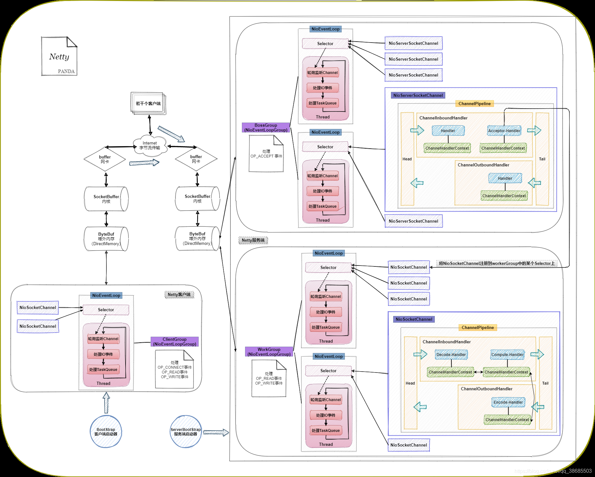

# Netty

Netty是一个异步事件驱动的网络应用程序框架，用于快速开发可维护的高性能协议服务器和客户端。基于JDK的NIO，极大地简化了TCP和UDP套接字服务器等网络编程，并且性能以及安全性等很多方面都要更好。**支持多种协议**，比如FTP、SMTP、HTTP以及各种二进制和基于文本的传统协议。

## Netty特点和优势：

- 使用简单：封装了NIO的很多细节，使用更简单
- 功能强大：预置了多种编解码功能，支持多种主流协议
- 定制能力强：可以通过ChannelHandler对通信框架进行灵活地扩展
- 性能高：与其他NIO框架相比，Netty的综合性能最优

## Netty性能高的原因：

- NIO线程模型：同步非阻塞
- 内存零拷贝：尽量减少不必要的内存拷贝，实现了更高效率的传输
- 内存池设计：申请的内存可以重用，主要指直接内存。内部实现是用一颗二叉查找树管理内存分配情况
- 串行化处理读写：避免使用锁带来的性能开销
- 高性能序列化协议：支持protobuf等高性能序列化协议

## BIO、NIO和AIO：

BIO：一个连接一个线程，客户端有连接请求时服务器端就启动一个线程进行处理。线程开销很大，可以使用线程池优化，但线程还是很宝贵的资源。

NIO：一个请求一个线程，但客户端发送的连接请求都会被注册到多路复用器上，多路复用器轮询到连接有IO请求时才启动一个线程进行处理。

AIO：一个有效请求一个线程，客户端的IO请求都是由OS先完成了再通知服务器应用启动线程进行处理。

## NIO的工作原理：

(1) 由一个专门的线程来处理所有的I/O事件，并负责分发。

(2) 事件驱动机制：事件到的时候触发，而不是同步的去监视事件。

(3) 线程通信：线程之间通过 wait、notify等方式通信，保证每次上下文切换都是有意义的，减少无谓的线程切换。

## 同步和异步、阻塞和非阻塞：

同步和异步主要看请求发起方对消息结果的获取时主动发起的还是被动通知的。如果是客户端主动发起的，就是同步，由服务端推送的，就是异步。阻塞和非阻塞指的是客户端等待消息处理时本身的状态，是挂起还是继续干别的。

## Netty运作过程

重要组件：

- Channel：Netty网络操作抽象类，包括基本的IO操作，如bind、connect、read、write等，比较常用的Channel接口实现类是NioServerSocketChannel(服务端)和NioSocketChannel(客户端)
- Bootstrap：Netty的工厂类，用来完成客户端或服务端的Netty初始化。Bootstrap是客户端的启动引导/辅助类，ServerBootstrap是服务端的启动引导/辅助类
- EventLoop：主要是配合Channel监听网络事件并调用事件处理器进行相关IO操作，用来处理连接的生命周期中所发生的事情
- ChannelFuture：Netty框架中所有的IO操作都是异步的，我们不能立刻得到操作是否执行成功，因此我们需要ChannelFuture的addListener()注册一个ChannelFutureListener监听事件，当操作执行成功或者失败时，监听就会自动触发返回结果
- ChannelHandler：消息的具体处理器，充当所有处理入站和出站数据的逻辑容器。主要用来处理各种事件，比如连接、数据接收、异常、数据转换等
- ChannelPipeline：为ChannelHandler链提供了容器，当channel创建时，就会被自动分配到它专属的ChannelPipeline，这个关联是永久性的

流程：

1. ServerBootStrap作为Netty服务端入口，会先初始化BossGroup和WorkGroup。在BossGroup中，主要是对客户端的新连接请求进行处理（即OP_ACCEPT事件），在WorkGroup中，则负责处理IO读写、编解码、业务逻辑等（即OP_READ事件、OP_WRITE事件）。服务端启动的时候会绑定一个端口，作为后续客户端连接入口，绑定端口的时候会在BossGroup(由NioEventLoopGroup类创建的对象)的其中一个NioEventLoop的Selector(多路复用器)上注册一条NioServerSocketChannel通道，后面的连接处理就是在通道中进行的。
2. BootStrap作为Netty的客户端入口，会先初始化ClientGroup。在ClientGroup中，第一就是创建与服务端的连接（即OP_CONNECT事件），第二就是进行IO读写、编解码、业务逻辑等操作（即OP_READ事件、OP_WRITE事件）。
3. 服务端和客户端启动后，当服务端收到客户端发来的连接请求，由于属于OP_ACCEPT事件，在BossGroup中处理。BossGroup管理若干个NioEventLoop，每个NioEventLoop持有一个线程（就像线程池中的一组线程并发处理若干个连接请求），每个NioEventLoop上会创建一个Selector，一个Selector上可以注册多个通道(所以称为多路复用器)，且它会以不断轮询的方式**同时监听**每个通道上是否有IO事件发生，每个通道里都会有个ChannelPipeline管道，包括管道头Head和管道尾Tail，以及进行IO读写、编解码、业务处理的若干个Handler，Handler可以自定义，把需要的Handler注册进管道就可以执行了。当请求到达Head时，代表“请求数据”已准备好，OP_ACCEPT事件已就绪，Selector监听到事件已就绪，就会让持有的线程对事件进行处理，处理过程是在Handler中进行：首先会创建一个NioSocketChannel实例，然后交给由Netty底层代码注册的ServerBootStrapAcceptor这个Handler。Acceptor具体操作就是向WorkGroup中的某个Selector注册刚刚创建好的NioSocketChannel，自此客户端连接请求结束。
4. 客户端发出连接请求的同时会自己创建一条NioSocketChannel通道与服务端NioSocketChannel进行互通，连接完之后就由WorkGruop处理，不再需要BossGroup。**一个客户端连接对应一条服务端NioSocketChannel**。例如当客户端要进行一个远程方法的调用时，将方法参数传给服务端后，服务端处理完将结果返回给客户端。首先请求从客户端通道传输到WorkGruop中的对应通道，然后Head会申请一块堆外内存来缓冲请求内容，缓冲完之后，代表数据已准备好，OP_READ事件已就绪，Selector监听到就绪事件之后，让持有的线程对事件进行处理，这里定义了Decode解码、Computer方法调用处理、Encode编码三个Handler进行操作。其中Inbound入站Handler包括Decoder和Computer（从Head到Tail就是入站），Outbound出站Handler包括Encode（从Tail到Head就是出站），每一个Handler被注册到Pipeline中的时候都会创建一个与之对应的ChannelHandlerContext，它包含着Handler的上下文信息，主要负责管理在同一个管道里的其他Handler之间的交互，它有一个前指针和后指针，可以与其他ChannelHandlerContext关联，这样Handler处理就变得更加灵活，比如这次请求需要三个Handler，而下次请求只涉及到Decode和Encode，那下次就可以执行完Decode然后指针直接指向Encode，next指针具体指向谁是依靠ChannelHandlerContext中的数据类型与其他Handler类型进行匹配得出的。在处理完读事件之后，接着处理Handler中涉及到的写事件，将处理结果写到ByteBuf中，回到Head，执行flush操作将ByteBuf内容写到SocketBuffer中，然后再到网卡buffer，通过互联网把结果传回给客户端，客户端拿到结果之后同样要进行解码、反序列化等操作，客户端在发送调用请求之前在Pipeline中也进行了Encode处理的。Head的主要作用：从SocketBuffer读请求内容到ByteBuf，从ByteBuf写返回结果到SocketBuffer。
5. 假设又有一个客户端连接了服务端，且和之前那个NioSocketChannel注册到同一个Selector上，当线程正在处理另一个通道上的事件的时候，这时候该客户端也发起了一个处理请求，请求到达服务端通道之后就会被Head读到堆外内存中缓冲着，此时OP_READ事件已经就绪，Selector监听到了就绪事件，但由于线程正在处理另外一个通道上的事件，所以就要等当前通道的事件处理完，下一轮循环监听再处理了（这也是堆外内存的作用体现之一，数据可以先在缓冲区放着）。当两个通道被注册在不同的Selector上的时候就互不影响的，因为是在不同的线程中并行处理的。

## Netty的线程模型

Netty 通过 Reactor 模型基于多路复用器接收并处理用户请求，内部实现了两个线程池， boss 线程池和 worker 线程池，其中 boss 线程池的线程负责处理请求的 accept 事件，当接收到 accept 事件的请求时，把对应的 socket 封装到一个 NioSocketChannel 中，并交给 worker 线程池，其中 worker 线程池负责请求的 read 和 write 事件，由对应的Handler 处理。

**单线程模型：**所有的IO操作都由一个线程完成，即多路复用、事件分发和处理都是在一个Reactor线程上完成的。既要接受客户端的连接请求，向服务端发起连接，又要发送/读取请求或应答/响应消息。一个NIO线程同时处理成百上千的链路，性能上无法支撑，对于高负载、大并发的应用场景不合适。

**多线程模型：**有一个线程（Acceptor）只负责监听服务端，接收客户端的TCP连接请求；NIO线程池负责网络IO的操作，即消息的读取、解码、编码和发送；一个NIO线程可以同时处理N条链路，但是1个链路只对应一个NIO线程，这是为了防止发生并发操作的问题。但是在百万并发客户端连接或需要安全认证时，一个Acceptor线程可能会存在性能不足的问题。

**主从多线程模型：**Acceptor线程用于绑定监听端口，接收客户端连接，将SocketChannel从主线程池的Reactor线程的多路复用器上移除，重新注册到Sub线程池的线程数，用于处理IO的读写等操作，从而保证mainReactor只负责接入认证、握手等操作。

## 解决TCP的粘包拆包问题

TCP是以流的方式来处理数据，一个完整的包可能会被TCP拆分成多个包进行发送，也可能把小的封装成一个大的数据包发送。

TCP粘包/分包的原因：应用程序写入的字节大小大于套接字发送缓冲区的大小，会发生拆包现象；而应用程序写入数据小于套接字缓冲区大小，网卡将应用多次写入的数据发送到网络上，这会发生粘包现象。

Netty自带的解决方式：

- 对于固定长度的消息：FixedLengthFrameDecoder类，每次会读取固定长度的消息，如果读到的消息不足指定长度，就会等待下一个消息到达后进行补足。
- 包尾增加特殊字符分割：
  - 行分隔符类：LineBasedFrameDecoder
  - 自定义分隔符类：DelimiterBasedFrameDecoder
- 将消息分为消息头和消息体：LengthFieldBasedFrameDecoder类。在生成的数据包中添加一个长度字段，用于记录当前数据包的长度。分为有头部的拆包与粘包、长度字段在前且有头部的拆包与粘包。

框架解决方式：

自定义协议，其中有字段标明包长度。

## Netty零拷贝

主要包含以下三个方面：

- Netty的接收和发送**ByteBuffer**采用DIRECT BUFFERS，使用堆外直接内存进行Socket读写，不需要进行字节缓冲区的二次拷贝。堆外直接内存不是操作系统分配的，而是java调用native方法自己分配的内存，所以操作数据不再需要堆内操作，可以直接在jvm内存以外的内存操作。如果使用传统的堆内存（HEAP BUFFERS）进行Socket读写，JVM会将堆内存Buffer拷贝一份到直接内存中，然后才写入Socket中。相比于堆外直接内存，消息在发送过程中多了一次缓冲区的内存拷贝。
- 有时候我们可能会需要将多个ByteBuffer组合起来使用才能完成某些业务逻辑，这样就需要再开辟一个更大的字节数组将所有ByteBuffer都复制过来。Netty提供了`CompositeByteBuf`类来组合Buffer对象，可以聚合多个ByteBuffer对象，用户将它们在逻辑上当成一个完整的ByteBuffer来操作，避免了通过内存拷贝的传统方式将几个小Buffer合并成一个大的Buffer。
- Netty的文件传输采用了transferTo方法，它可以直接将文件缓冲区的数据发送到目标Channel，数据不在用户空间和内存空间之间拷贝，避免了通过循环write的传统方式导致的内存拷贝问题。

## 序列化方式

- **JSON** ，是一种轻量级的数据交换语言，以易于阅读的文字为基础。采用**字符**方式存储，占用相对于字节方式较大，并且序列化后类的信息会丢失，可能导致反序列化失败。

以下是基于**字节**的序列化

- **Kryo**，是一个快速高效的Java序列化框架。速度快，序列化后体积小，但是跨语言支持较复杂。
- **Hessian**，是一个基于二进制的协议，支持很多语言。序列化和反序列化的速度较慢，序列化后的体积也较大。
- **Protobuf**，提供跨语言、跨平台的序列化和反序列化实现。在C++其他的平台上使用时必须先进行预编译。序列化和反序列化性能较高，速度较快，序列化后的字节数很小，适合网络传输节省IO，是平台无关的。

序列化方式衡量标准

1.是否支持跨语言，支持语种是否丰富
2.编码后的码流
3.编解码的性能
4.类库是否小巧，API使用是否方便
5.使用者开发的工作量和难度。

JSON类库，更适用于业务场景的开发，类的拷贝复制，不适合网络传输，性能低于其他类别的序列化方式

其他的类库，更倾向于中间件的设计，网络传输

## 服务器宕机

服务器宕机，写一个spring定时任务或者linux的shell脚本，定时的去监测与服务器的连接是否可用，如果可用就发数据.不可用就重新建立连接

## 客户端断线重连

1、断线重连
 断线时，触发channelInactive方法，然后调用run()方法实现重连；

2、client启动连接服务器时，连接失败，调用run()方法实现重连；
 run()：重连，如果没有连上服务端，则触发channelInactive方法，再次循环调用run()；如果连接上，则触发channelActive方法，把clientId和socketChannel存储起来

3、利用userEventTriggered实现心跳维护

## Netty解决IO阻塞在业务代码上

- 时间可控的简单业务直接在IO线程上处理

  如果业务非常简单，执行时间非常短，不需要与外部网元交互、访问数据库和磁盘，不需要等待其它资源，则建议直接在业务ChannelHandler中执行，不需要再启动业务的线程或者线程池。避免线程上下文切换，也不存在线程并发问题。

- 复杂和时间不可控业务建议投递到后端业务线程池统一处理

  对于此类业务，不建议直接在业务ChannelHandler中启动线程或者线程池处理，建议将不同的业务**统一封装成Task**，统一投递到后端的业务线程池中进行处理。

  过多的业务ChannelHandler会带来开发效率和可维护性问题，不要把Netty当作业务容器，对于大多数复杂的业务产品，仍然需要集成或者开发自己的业务容器，做好和Netty的架构分层。

- 业务线程避免直接操作ChannelHandler

  对于ChannelHandler，IO线程和业务线程都可能会操作，因为业务通常是多线程模型，这样就会存在多线程操作ChannelHandler。

  为了尽量避免多线程并发问题，建议按照Netty自身的做法，通过将操作封装成独立的Task由NioEventLoop统一执行，而不是业务线程直接操作

## 一个EventLoop是一个线程在执行

`NIOEventLoop`继承`SingleThreadEventLoop`，`SingleThreadEventLoop`继承`SingleThreadEventExecutor`。而`SingleThreadEventExecutor`是Netty对本地线程的抽象，它内部有一个Thread属性，实际上就是存储了一个本地Java线程。因此我们可以简单地认为，一个NIOEventLoop对象其实就是和一个特定的线程进行绑定，并且在NIOEventLoop生命周期内，其绑定的线程都不会再改变。
