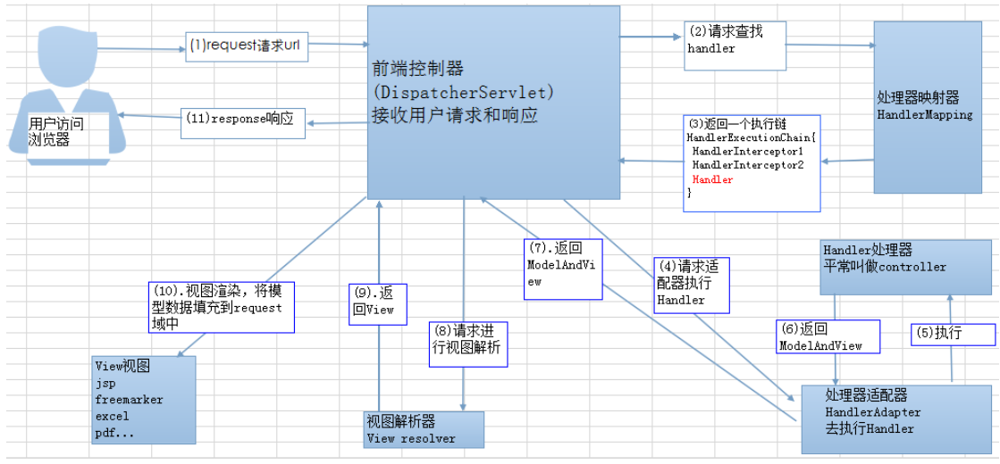
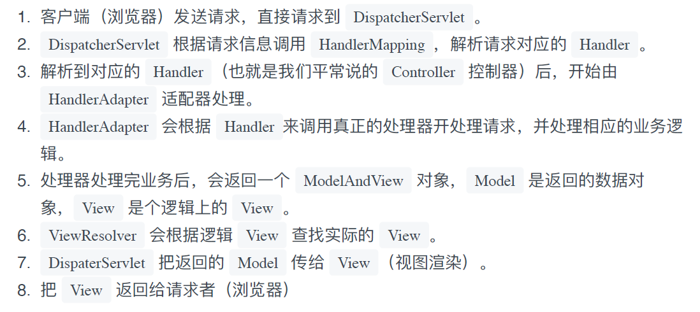
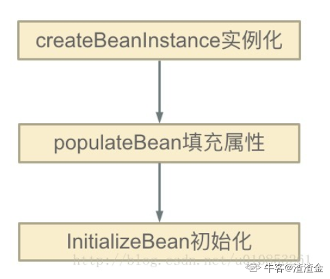
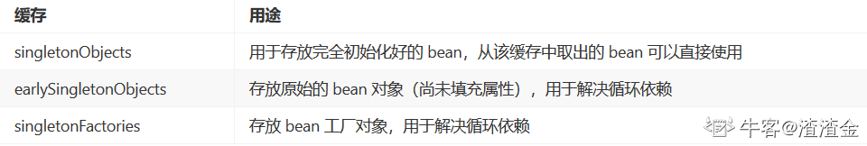

# Spring

## 1、Spring IOC 原理

#### 概念

IOC就是**控制反转**的意思，即把对象创建和对象之间的调用过程，交给Spring来进行管理

在实际项目开发中，我们往往是通过类与类之间的相互协作来完成特定的业务逻辑，这个时候，每个类都要管理与自己有交互的类的引用和依赖，这就使得代码的维护异常困难并且耦合度过高，而IOC的出现正是为了解决这个问题，IOC将类与类的依赖关系写在配置文件中，程序在运行时根据配置文件动态加载依赖的类，**降低类与类之间的耦合度**。

#### 原理

**底层原理**：xml解析、工厂模式、**反射**

它的原理是在**applicationContext.xml**加入bean标签,在bean标签中通过class属性说明具体类名、通过property标签说明该类的属性名、通过constructor-args说明构造子类参数。

其一切都是反射，当通过**applicationContext.getBean("id名称")**得到一个类实例时，就是以bean标签的类名、属性名、构造子类的参数为准，通过反射实例对象，唤起对象的set方法设置属性值、通过构造子类的newInstance实例化得到对象。

## 2、Spring AOP原理

AOP 即面向切面编程，简单地说就是将代码中重复的部分抽取出来，在需要执行的时候使用动态代理技术，在不修改源码的基础上对方法进行增强。**总结：在目标对象（target object）的某些方法（jointpoint）添加不同种类的操作（通知、增强操处理），最后通过某些方法（weaving、织入操作）实现一个新的代理目标对象。**

Spring 根据类是否实现接口来判断动态代理方式，如果实现接口会使用 JDK 的动态代理，核心是 InvocationHandler 接口和 Proxy 类，如果没有实现接口会使用 CGLib 动态代理，CGLib 是在运行时动态生成某个类的子类，如果某个类被标记为 final，不能使用 CGLib 。

JDK 动态代理主要通过重组字节码实现，首先获得被代理对象的引用和所有接口，生成新的类必须实现被代理类的所有接口，动态生成Java 代码后编译新生成的 `.class` 文件并重新加载到 JVM 运行。JDK 代理直接写 Class 字节码，CGLib 是采用 ASM 框架写字节码，生成代理类的效率低。但是 CGLib 调用方法的效率高，因为 JDK 使用反射调用方法，CGLib 使用 FastClass 机制为代理类和被代理类各生成一个类，这个类会为代理类或被代理类的方法生成一个 index，这个 index 可以作为参数直接定位要调用的方法。


Spring AOP中的动态代理主要有两种方式，JDK动态代理和CGLIB动态代理：

- JDK动态代理只提供接口的代理，不支持类的代理。核心InvocationHandler接口和Proxy类，InvocationHandler 通过invoke()方法反射来调用目标类中的代码，动态地将横切逻辑和业务编织在一起；接着，Proxy利用 InvocationHandler动态创建一个符合某一接口的的实例, 生成目标类的代理对象。
- 如果代理类没有实现 InvocationHandler 接口，那么Spring AOP会选择使用CGLIB来动态代理目标类。CGLIB（Code Generation Library），是一个代码生成的类库，可以在运行时动态的生成指定类的一个子类对象，并覆盖其中特定方法并添加增强代码，从而实现AOP。CGLIB是通过继承的方式做的动态代理，因此如果某个类被标记为final，那么它是无法使用CGLIB做动态代理的。
  

常用场景包括权限认证、自动缓存、错误处理、日志、调试和事务等。

**AOP相关注解**

`@Aspect`：声明被注解的类是一个切面 Bean。

`@Before`：前置通知，指在某个连接点之前执行的通知。

`@After`：后置通知，指某个连接点退出时执行的通知（不论正常返回还是异常退出）。

`@AfterReturning`：返回后通知，指某连接点正常完成之后执行的通知，返回值使用returning属性接收。

`@AfterThrowing`：异常通知，指方法抛出异常导致退出时执行的通知，和`@AfterReturning`只会有一个执行，异常使用throwing属性接收。


## 3、SpringMVC的处理流程






## 4、Spring事务

##### spring中事务的实现方式：

1. 编程式事务管理。需要在代码中调用beginTransaction()、commit()、rollback()等事务管理相关的方法(已经不用了)。
2. 基于 `TransactionProxyFactoryBean`的声明式事务管理。
3. **基于 `@Transactional` 的声明式事务管理**。
4. 基于Aspectj AOP配置事务，实际上是**CGlib**动态代理。

##### springboot使用事务：

首先使用注解 `@EnableTransactionManagement` 开启事务支持后，然后在访问数据库的Service方法上添加注解 `@Transactional `便可。

被` @Transactional` 注解的方法，将支持事务。如果注解在类上，则整个类的所有方法都默认支持事务。

如果你在方法上定义的话，方法的`@Transactional`会覆盖类上面声明的事务。

##### spring中的事务传播行为：

事务传播行为用来描述由某一个事务传播行为修饰的方法被嵌套进另一个方法时事务如何传播。

```java
Propagation.REQUIRED（Spring默认的传播机制是这一个）
```

1.在外围方法未开启事务的情况下`Propagation.REQUIRED`修饰的内部方法会新开启自己的事务，且开启的事务相互独立，互不干扰

2.外围方法开启事务的情况下`Propagation.REQUIRED`修饰的内部方法会加入到外围方法的事务中，所有`Propagation.REQUIRED`修饰的内部方法和外围方法均属于同一事务，只要一个方法回滚，整个事务均回滚。(共为一个事务)

```java
Propagation.REQUIRED_NEW
```

1.在外围方法未开启事务的情况下`Propagation.REQUIRES_NEW`修饰的内部方法会新开启自己的事务，且开启的事务相互独立，互不干扰。

2.在外围方法开启事务的情况下`Propagation.REQUIRES_NEW`修饰的内部方法依然会单独开启独立事务，且与外部方法事务也独立，内部方法之间、内部方法和外部方法事务均相互独立，互不干扰。（完全相互独立）

```java
Propagation.NESTED
```

1.在外围方法未开启事务的情况下`Propagation.NESTED`和`Propagation.REQUIRED`作用相同，修饰的内部方法都会新开启自己的事务，且开启的事务相互独立，互不干扰。

2.在外围方法开启事务的情况下`Propagation.NESTED`修饰的内部方法属于外部事务的子事务，外围主事务回滚，子事务一定回滚，而内部子事务可以单独回滚而不影响外围主事务和其他子事务。（外部回滚，内部一定回滚；内部回滚不影响外部）


`Propagation.SUPPORTS`：支持当前事务，如果当前没有事务，就不以事务方式运行。

`Propagation.MANDATORY`：一定要在事务中运行，调用此方法必须原先就有一个事务，否则运行时抛异常。

`Propagation.NOT_SUPPORTED`：以非事务方式执行，如果之前有事务，将之前事务挂起，此方法内无事务执行。

`Propagation.NEVER`：以非事务方式执行，如果之前有事务就抛异常。


##### spring中事务的原理

**借助AOP中动态代理的思想，借助方法拦截器（MethodInterceptor），使用cglib代理，在加入事务处理的方法上额外加一些操作。**


## 5、Spring Bean的生命周期


## 6、SSM框架各自的作用

**Spring：**Spring容器可以协调上下文，管理对象之间的依赖，提供事务机制

**Spring MVC：**拥有控制器，可以接收外部请求，解析参数传给服务层

**Mybatis：**属于orm持久性框架，将业务实体与数据表联合起来，主要用来操作数据库。


## 7、Spring常用注解

`@Scope`注解 作用域

`@PostConstruct`用于指定初始化方法（用在方法上）
`@PreDestory`用于指定销毁方法（用在方法上)

`@Value` ：用于注入基本数据类型和 String 类型。

**声明Bean的注解**

`@Service`用于标注业务层组件、
`@Controller`用于标注控制层组件（如struts中的action）
`@Repository`用于标注数据访问组件，即DAO组件。
`@Component`泛指组件，当组件不好归类的时候，我们可以使用这个注解进行标注。

**注入Bean的注解**

`@Autowired`：自动装配，自动按类型注入，如果有多个匹配则按照指定 Bean 的 id 查找，查找不到会报错。

`@Qualifier`：在自动按照类型注入的基础上再按照 Bean 的 id 注入，给变量注入时必须搭配 `@Autowired`，给方法注入时可单独使用。

`@Resource` ：直接按照 Bean 的 id 注入，只能注入 Bean 类型。

`@Inject` : JSR-330提供的注解

**配置文件的注解**

`@Configuration`把一个类作为一个IoC容器，它的某个方法头上如果注册了@Bean，就会作为这个Spring容器中的Bean。

`@ComponentScan` (cn.test.demo): 自动扫描包名下所有使用 @Component @Service  @Repository @Controller 的类,并注册为Bean

`@Bean` : 注解在方法上,声明当前方法的返回值为一个Bean.

**SpringMVC常用注解**

`@RequtestMapping`：将URL请求和业务方法映射起来，在类和方法定义上都可以添加该注解。`value` 属性指定URL请求的实际地址，是默认值。`method` 属性限制请求的方法类型，包括GET、POST、PUT、DELETE等。如果没有使用指定的请求方法请求URL，会报405 Method Not Allowed 错误。`params` 属性限制必须提供的参数，如果没有会报错。

`@ResponseBody `: 支持将返回值放入response体内 而不是返回一个页面(返回的是一个组数据)

`@RequestBody `: 允许request的参数在request体中,而不是直接连接在地址后面 次注解放置在参数前

`@RestController` : @Controller + @ResponseBody 组合注解

`@RequestParam`：如果 Controller 方法的形参和 URL 参数名一致可以不添加注解，如果不一致可以使用该注解绑定。`value` 属性表示HTTP请求中的参数名。`required` 属性设置参数是否必要，默认false。`defaultValue` 属性指定没有给参数赋值时的默认值。

`@PathVariable`：接收路径参数，通过 `@PathVariable` 完成请求参数与形参的绑定。


## 8、Spring 框架中都用到了哪些设计模式？

工厂模式：BeanFactory就是简单工厂模式的体现，用来创建对象的实例；
单例模式：Bean默认为单例模式。
代理模式：Spring的AOP功能用到了JDK的动态代理和CGLIB字节码生成技术；
模板方法：用来解决代码重复的问题。比如. RestTemplate, JmsTemplate, JpaTemplate。
观察者模式：定义对象键一种一对多的依赖关系，当一个对象的状态发生改变时，所有依赖于它的对象都会得到通知被制动更新，如Spring中listener的实现–ApplicationListener。


## 9、依赖注入方式

依赖注入分为接口注入（Interface Injection），Setter方法注入（Setter Injection）和构造器注入（Constructor Injection）三种方式。其中接口注入由于在灵活性和易用性比较差，现在从Spring4开始已被废弃。

构造器依赖注入：构造器依赖注入通过容器触发一个类的构造器来实现的，该类有一系列参数，每个参数代表一个对其他类的依赖。

Setter方法注入：Setter方法注入是容器通过调用无参构造器或无参static工厂 方法实例化bean之后，调用该bean的setter方法，即实现了基于setter的依赖注入。


## 10、Spring中Bean的作用域

Spring框架支持以下五种bean的作用域：

- singleton : bean在每个Spring ioc 容器中只有一个实例。
- prototype：一个bean的定义可以有多个实例。
- request：每次http请求都会创建一个bean，该作用域仅在基于web的Spring ApplicationContext情形下有效。
- session：在一个HTTP Session中，一个bean定义对应一个实例。该作用域仅在基于web的Spring ApplicationContext情形下有效。
- global-session：在一个全局的HTTP Session中，一个bean定义对应一个实例。该作用域仅在基于web的Spring ApplicationContext情形下有效。


## 11、使用`@Autowired`注解自动装配的过程

在启动spring IoC时，容器自动装载了一个AutowiredAnnotationBeanPostProcessor后置处理器，当容器扫描到@Autowied、@Resource或@Inject时，就会在IoC容器自动查找需要的bean，并装配给该对象的属性。在使用@Autowired时，首先在容器中查询对应类型的bean：

- 如果查询结果刚好为一个，就将该bean装配给@Autowired指定的数据；
- 如果查询的结果不止一个，那么@Autowired会根据名称来查找；
- 如果上述查找的结果为空，那么会抛出异常。解决方法是，使用required=false。


## 12、Spring和SpringMVC的区别

Spring是IOC和AOP的容器框架，SpringMVC是基于Spring功能之上添加的Web框架，想用SpringMVC必须先依赖Spring。Spring可以说是一个管理bean的容器，也可以说是包括很多开源项目的总称，spring mvc是其中一个开源项目，所以简单走个流程的话，http请求一到，由容器（如：tomact）解析http搞成一个request，通过映射关系（路径，方法，参数）被spring mvc一个分发器去找到可以处理这个请求的bean，那tomcat里面就由spring管理bean的一个池子（bean容器）里面找到，处理完了就把响应返回回去。


## 13、Spring 怎么解决循环依赖问题？

spring对循环依赖的处理有三种情况： ①构造器的循环依赖：这种依赖spring是处理不了的，直 接抛出BeanCurrentlylnCreationException异常。 ②单例模式下的setter循环依赖：通过“三级缓存”处理循环依赖。 ③非单例循环依赖：无法处理。

下面分析单例模式下的setter循环依赖如何解决

Spring的单例对象的初始化主要分为三步



（1）createBeanInstance：实例化，其实也就是调用对象的构造方法实例化对象

（2）populateBean：填充属性，这一步主要是多bean的依赖属性进行填充

（3）initializeBean：调用spring xml中的init 方法。

从上面讲述的单例bean初始化步骤我们可以知道，循环依赖主要发生在第一、第二步。也就是构造器循环依赖和field循环依赖。




举例：A的某个field或者setter依赖了B的实例对象，同时B的某个field或者setter依赖了A的实例对象”这种循环依赖的情况。A首先完成了初始化的第一步（createBeanINstance实例化），并且将自己提前曝光到singletonFactories中。

此时进行初始化的第二步，发现自己依赖对象B，此时就尝试去get(B)，发现B还没有被create，所以走create流程，B在初始化第一步的时候发现自己依赖了对象A，于是尝试get(A)，尝试一级缓存singletonObjects(肯定没有，因为A还没初始化完全)，尝试二级缓存earlySingletonObjects（也没有），尝试三级缓存singletonFactories，由于A通过ObjectFactory将自己提前曝光了，所以B能够通过

ObjectFactory.getObject拿到A对象(虽然A还没有初始化完全，但是总比没有好呀)，B拿到A对象后顺利完成了初始化阶段1、2、3，完全初始化之后将自己放入到一级缓存singletonObjects中。

此时返回A中，A此时能拿到B的对象顺利完成自己的初始化阶段2、3，最终A也完成了初始化，进去了一级缓存singletonObjects中，而且更加幸运的是，由于B拿到了A的对象引用，所以B现在hold住的A对象完成了初始化。


# Spring注解源码

### 1.容器

#### (1) 向容器中注册bean的方法

1) 包扫描+组件标注注解(`@Controller/@Service/@Repository/@Component`)

2) `@Bean`[导入的第三方包里的组件]

3) `@Import`[快速给容器中导入一个组件]

​	  1) `@Import`(要导入到容器中的组件)；容器中就会自动注册这个组件，id默认是全类名

​	  2) **`ImportSelector`**:返回需要导入的组件的全类名数组	**SpringBoot常用**

​	  3) `ImportBeanDefinitionRegistrar`：手动注册bean到容器中

4) 使用Spring提供的FactoryBean(工厂Bean)

​		1) 默认获取到的是工厂bean调用getObject创建的对象

​		2) 要获取工厂bean本身，我们需要给id前面加一个&

#### (2) bean的生命周期

​	bean创建---初始化---销毁的过程

容器管理bean的生命周期：

我们可以自定义初始化和销毁的方法；容器在bean进行到当前生命周期的时候来调用我们自定义的初始化和销毁方法

构造(对象创建)

​	单例：在容器启动的时候创建对象

​	多实例：在每次获取的时候创建对象


执行顺序：

执行`BeanPostProcessor.postProcessBeforeInitialization`

初始化：

​		对象创建完成，并赋值好，调用初始化方法。。。

执行`BeanPostProcessor.postProcessAfterInitialization`

销毁：

​		单实例：容器关闭的时候

​		多实例：容器不会管理这个bean；容器不会调用销毁方法


自定义初始化方法的方式：

1）指定初始化和销毁方法：

​		通过`@Bean`指定init-method和destory-method；

2）通过让Bean实现`InitializingBean`(定义初始化逻辑)

​							实现`DisposableBean`(定义销毁逻辑)；

3）使用JSR250标准：

​		`@PostConstruct`：在bean创建完成并且属性赋值完成后来执行初始化方法

​		`@PreDestroy`：在容器销毁bean之前通知我们进行清理工作

4）`BeanPostProcessor`接口：bean的后置处理器：

​		在bean初始化前后进行一些处理工作：

​		`postProcessBeforeInitialization`：在初始化之前工作

​		`postProcessAfterInitialization`：在初始化之后工作


​	`BeanPostProcessor`原理

执行顺序：

```java
populateBean(beanName, mbd, instanceWrapper);//给Bean进行属性赋值
initializeBean
{
    applyBeanPostProcessorsBeforeInitialization(wrappedBean, beanName);
    invokeInitMethods(beanName, wrappedBean, mbd);//执行自定义初始化方法
    applyBeanPostProcessorsAfterInitialization(wrappedBean, beanName);
}
```


`applyBeanPostProcessorsBeforeInitialization`的实现：

遍历得到容器中所有的`BeanPostProcessor`，挨个执行`beforeInitialization`，一旦返回null，跳出for循环，不会执行后面的`BeanPostProcessor.postProcessorsBeforeInitialization`


Spring底层对`BeanPostProcessor`的使用：

​		bean赋值，注入其他组件，`@Autowired`，生命周期注解功能，`@Async,xxx BeanPostProcessor`


#### (3) bean的属性赋值

1. 使用`@Value`赋值
2. 使用`@PropertySource`加载外部配置文件


#### (4) bean自动装配

​		Spring利用依赖注入(DI)，完成对IOC容器中各个组件的依赖关系赋值。

​	1） `@Autowired`自动注入：

​			1. 默认优先按照类型去容器中找对应的组件 ：`applicationContext.getBean(BookService.class);`

​			2. 如果找到多个相同类型的组件，再将属性的名称作为组件的id去容器中查找																					`applicationContext.getBean("bookDao");`

​			3. `@Qualifier("bookDao")`：使用 `@Qualifier`指定需要装配的组件的id，而不是使用属性名

​			4. 自动装配一定要将属性赋值好，没有就会报错。   可以使用`@Autowired(required = false)`来设置找不到不会报错。

​			5. `@Primary`注解：让Spring进行自动装配的时候，默认使用首选的bean，即`@Primary`修饰的bean。也可以继续使用`@Qualifier`指定需要装配的bean的名字							

​	2）Spring还支持使用`@Resource`和`@Inject`实现自动装配

原理：

使用 `AutowiredAnnotationBeanPostProcessor`解析完成自动装配功能。

​	

​	3）`@Autowired`可以修饰构造器、参数、方法、属性。都是从容器中获取参数组件的值。


​	4）如果自定义组件想要使用Spring容器底层的一些组件(ApplicationContext,BeanFactory,xxx);

​			只需要自定义组件实现xxxAware; 在创建对象的时候，会调用接口规定的方法注入相关组件。`Aware`

​			把Spring底层的一些组件注入到自定义的Bean中

​			xxxAware：功能使用xxxProcessor来实现；

​					如`ApplicationContextAware`通过`ApplicationCOntextAwareProcessor`实现，用来帮我们把对象注入到IOC容器。

​					

​	5）`Profile`：Spring为我们提供的可以根据当前环境(开发环境、测试环境、生产环境)，动态的激活和切换一系列组件的功能；


### 2. AOP原理【看给容器中注册了什么组件，这个组件什么时候工作，这个组件的功能是什么】

**`@EnableAspectJAutoProxy`**

1、`@EnableAspectJAutoProxy`是什么？

​	`@Import(AspectJAutoProxyRegistrar.class)`：给容器中导入AspectJAutoProxyRegistrar

​				利用AspectJAutoProxyRegistrar自定义给容器中注册bean；BeanDefinetion

​				internalAutoProxyCreator = AnnotationAwareAspectJAutoProxyCreator

​	给容器中注册一个AnnotationAwareAspectJAutoProxyCreator (自动代理创建器)


2、AnnotationAwareAspectJAutoProxyCreator

```java
AnnotationAwareAspectJAutoProxyCreator
	->AspectJAwareAdvisorAutoProxyCreator
    	->AbstractAdvisorAutoProxyCreator
    		->AbstractAutoProxyCreator
    			implements SmartInstantiationAwareBeanPostProcessor, BeanFactoryAware
```

​							关注后置处理器(在bean初始化前后做事情)、自动装配BeanFactory

```java
AbstractAutoProxyCreator.setBeanFactory();
AbstractAutoProxyCreator.有后置处理器的逻辑;

AbstractAdvisorAutoProxyCreator.setBeanFactory()->initBeanFactory();

AnnotationAwareAspectJAutoProxyCreator.initBeanFactory();
```


3、流程

1）传入配置类，创建IOC容器

2） 注册配置类，调用refresh()刷新容器

3）`registerBeanPostProcessors(beanFactory);`注册bean的后置处理器来方便拦截bean的创建

​		1.先获取IOC容器已经定义了的需要创建对象的所有BeanPostProcessor

​		2.给容器中加别的PostProcessor 

​		3.优先注册实现了PriorityOrderd接口的BeanPostProcessor

​		4.再给容器中注册实现了Ordered接口的BeanPostProcessor

​		5.注册没实现优先级接口的BeanPostProcessor

​		6.注册BeanPostProcessor，实际上就是创建BeanPostProcessor对象，保存在容器中

​				创建internalAutoProxCreator的BeanPostProcessor【AnnotationAwareAspectJAutoProxyCreator】

​				①创建Bean的实例

​				②populateBean; 给bean的各种属性赋值

​				③initializeBean：初始化bean;

​					1）invokeAwareMethods()：处理Aware接口的方法回调

​					2）applyBeanPostProcessorsBeforeInitialization()：应用后置处理器的BeforeInitialization()

​					3）invokeInitMethods()：执行自定义的初始化方法

​					4）applyBeanPostProcessorsAfterInitialization()：应用后置处理器的AfterInitialization()

​				④BeanPostProcessor(AnnotationAwareAspectJAutoProxyCreator)创建成功

​		7.把BeanPostProcessor注册到BeanFactory中 ==》beanFactory.addBeanPostProcessor(postProcessor);

==以上是创建和注册AnnotationAwareAspectJAutoProxyCreator的过程==

​	AnnotationAwareAspectJAutoProxyCreator ==> InstantiationAwareBeanPostProcessor

4）finishBeanFactoryInitialization(beanFactory); 完成BeanFactory初始化工作，创建剩下的单实例bean

​	1.遍历获取容器中的所有bean，依次创建对象getBean(beanName)；

​			getBean
