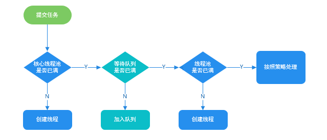

# 面试总结

## 1、Synchronized锁升级的过程（4.13  端点科技）

JDK1.6之后，synchronized做了很多优化，使得它并不总是一个重量级锁。锁一共有四个状态，级别从低到高依次是：无锁、偏向锁、轻量级锁、重量级锁。锁可以升级但不能降级，这是因为提高锁获得和释放的效率。

synchronized的原理：

使用synchronized同步代码块的时候，经编译后，会在代码块的起始位置插入**monitorenter**指令，在结束或异常处插入**monitorexit**指令，当执行到monitorenter指令时，会尝试获取对象所对应的**monitor**的所有权，也就是尝试获取对象的锁。而synchronized用的锁是存放在java对象头中的。Java对象头中有一个**Mark Word**字段用来存放对象的HashCode，分代年龄、**是否偏向锁**(1bit)和**锁标志位信息**(2bit)。给对象加锁就会修改MarkWord。


##### (1) 无锁  **Mark Word**标志位为01，是否偏向锁为0

无锁是指没有对资源进行锁定，所有的线程都能访问并修改同一个资源，但同时只能有一个线程能够修改成功。

##### (2) 偏向锁  **Mark Word**标志位为01，与无锁标志位一样。但是否偏向锁为1

偏向锁是指当一段同步代码一直被同一个线程所访问时，也就是不存在多个线程的竞争时，那么该线程在后续访问时就会自动获得锁，从而降低锁带来的消耗，提高性能。

偏向锁获取过程：

1. 当锁对象第一次被线程获取时，首先判断该是否为可偏向状态，也就是MarkWord中锁标志位是否为01，是否偏向锁是否为1.
2. 如果是可偏向状态(状态码为1)，则通过CAS将线程ID写入MarkWord，**a)** 如果CAS成功，则写入线程ID后执行同步代码；**b)** 如果CAS失败，表示有其它线程已经获得偏向锁，这种情况说明当前锁存在竞争，需要撤销已经获得偏向锁的线程，并且升级为轻量级锁。
3. 如果是已偏向状态(状态码为0)，则检查MarkWord中的线程ID是否等于当前线程的ID，**a)** 如果相等，不需要再次获得锁，直接执行同步代码；**b)** 如果不相等，说明当前锁偏向于其他线程，需要撤销偏向锁，升级为轻量级锁。

偏向锁的撤销：

偏向锁不会主动撤销，只有遇到其他线程竞争时才会执行撤销。撤销过程需要等待全局安全点，就是在某个时间点上没有字节码正在执行时进行，有两种情况：

1. 原获得偏向锁的线程已经退出了临界区，也就是同步代码块已经执行完毕。那么这个时候会把对象头设置成无锁状态。
2. 原获得偏向锁的线程的同步代码块还没有执行完，处于临界区之内，那么这个时候就会把原获得偏向锁的线程升级为轻量级锁后继续执行同步代码块。

##### (3)轻量级锁 **Mark Word**标志位为00

轻量级锁是为了在没有竞争的情况下减少重量级锁使用操作系统互斥量产生的性能消耗，主要针对多个线程在不同时间请求同一把锁的场景。

轻量级锁获取过程：

1. 原持有偏向锁的线程在自己的栈帧中划出一块空间，作为该锁的锁记录(Lock Record)，并且将锁对象的MarkWord复制到创建的锁记录中。复制成功后，JVM使用CAS将**对象头MarkWord中加入一个指向锁记录的指针**，并将锁记录里的**owner**指针指向对象头的MarkWord。
2. 如果CAS成功，那么当前线程就持有了该对象的锁，并且将对象MarkWord的锁标志位设置为00，表示此对象处于轻量级锁状态。
3. 如果失败，JVM先检查对象的MarkWord是否指向当前线程的栈帧，**a)** 如果是就说明当前线程已经拥有了这个对象的锁，表示锁重入，可以直接进入同步代码继续执行；**b)** 如果否就表示该对象已经被其他线程抢占，则进行**自旋等待**(默认10次)，若等待超过阈值时仍未获取到锁，则升级为重量级锁(锁膨胀)。
4. 另外，当一个线程已持有锁，另一个线程在自旋，此时又有第三个线程来访时，轻量级锁也会升级为重量级锁(锁膨胀)。

轻量级锁释放过程：

1. 通过CAS操作尝试把线程栈帧中复制的锁记录中的MarkWord信息替换当前对象头的MarkWord，替换成功则同步代码块执行顺利结束。替换失败则说明已经膨胀为重量级锁，则在执行完同步代码块后释放锁同时唤醒被挂起的线程。

##### (4)重量级锁 **Mark Word**标志位为10

重量级锁指当有一个线程获取锁之后，其余所有等待获取该锁的线程都会处于阻塞状态。

重量级锁通过对象内部的监视器monitor实现，其本质是依赖于底层操作系统的Mutex Lock实现，操作系统实现线程之间的切换需要从用户态切换到内核态，成本非常高。


##### 总结：

synchronized的执行过程：

1. 检查对象的MarkWord里是不是当前线程的ID，如果是，表示当前线程处于偏向锁
2. 如果不是，则使用CAS将当前线程的ID替换MarkWord，如果成功则表示当前线程获取偏向锁，将偏向标志位置为1
3. 如果失败，说明发生竞争，撤销偏向锁，升级为轻量级锁
4. 升级后，当前线程使用CAS将对象头的MarkWord替换为锁记录指针，如果成功，则当前线程获得锁
5. 如果失败，表示其他线程竞争锁，当前线程尝试使用自旋来获取锁
6. 如果自旋成功则依然处于轻量级锁状态
7. 自旋失败，升级为重量级锁


## 2、MySQL索引（4.13  端点科技）

索引就是对数据库表中一列或多列的值进行排序的一种结构。使用索引可**快速访问数据库表**中的特定信息，就像一本书的目录一样，可以加快查询速度。

**索引是一个为了加快查询速度而使用的数据结构。mySql中通过B+树实现了索引。** 

  **B+树的一个特点是数据只保存在叶子节点中，而且叶子节点间形成一个单链表，适合进行区间查找。mySql根据这个特性，将叶子节点和非叶节点保存在不同的段中，而每个段包含多个区，每个区以数据块形式保存，这样在实际查询数据时可以使用顺序io而非随机io。**

#### MySQL的索引分类：

1. 普通索引：index：加速查找

2. 唯一索引

   主键索引：primary key：加速查找+约束（不为空且唯一）

   唯一索引：unique：加速查找+约束（唯一）

3. 联合索引

   primary key(id, name)：联合主键索引

   unique(id, name)：联合唯一索引

   index(id, name)：联合普通索引

4. 全文索引 fulltext：用于搜索一篇很长的文章时效果最好

**除主键索引之外的索引都为二级索引(辅助索引)，其叶子节点存储的数据都是主键。也就是说，通过二级索引，可以定位主键的位置。**

#### 索引的两大类型：

MySQL索引使用的数据结构主要由**B+Tree索引**和**哈希索引**

Hash类型的索引：查询单条快，范围查询慢

B-tree类型的索引：B+树，层数越多，数据量指数级增长


#### 创建索引的语法:

```mysql
#方法一：创建表时
	Create Table 表名(
    		字段名1 数据类型,
    		字段名1 数据类型,
        	[UNIQUE | FULLTEXT] INDEX | KEY
        	[索引名] (字段名[(长度)]) [ASC | DESC]
    	);

#方法二：使用CREATE在已存在的表上创建索引
	Create [UNIQUE | FULLTEXT] INDEX 索引名
			ON 表名 (字段名[(长度)]) [ASC | DESC];

#方法三：使用ALTER TABLE在已存在的表上创建索引
	Alter Table 表名 ADD [UNIQUE | FULLTEXT] INDEX
				索引名 (字段名[(长度)]) [ASC | DESC];

#删除索引：
	Drop INDEX 索引名 ON 表名;
```


#### 索引的优缺点分析：

##### 索引的优点

可以大大加快数据的检索速度。另外，通过创建唯一性索引，可以保证数据库表中每一行数据的唯一性。

##### 索引的缺点

1. **创建和维护索引需要耗费许多时间**：当对表中的数据进行增删改的时候，如果数据有索引，那么索引也需要动态的修改，会降低SQL执行效率。
2. **占用物理存储空间**


#### B树和B+树的区别

- B树所有节点既存放**键(Key)**，也存放**数据(Data)**；而B+树只有**叶子节点**存放**Key**和**Data**，其它内节点只存放**Key**。之所以这么做是因为在数据库中页的大小是固定的，如果不存储数据就会存储更多的键值，相应树的阶数就会更大，树就会更矮更胖，进行磁盘IO的次数就会减少，查询效率更快。
- B树的叶子节点都是独立的；B+树的叶子节点有一条引用链指向与它相邻的叶子节点
- B树的检索过程相当于对范围内每个节点的关键字做二分查找，可能还没有到达叶子节点，检索就结束了。而B+树的检索效率稳定，任何查找都是从根节点到叶子节点的过程。


#### Hash索引和B+树索引优劣分析

##### Hash索引定位快

Hash 索引指的就是 Hash 表，最大的优点就是能够在很短的时间内，根据 Hash 函数定位到数据所在的位置，这是 B+树所不能比的。

**Hash 冲突问题**

知道 HashMap 或 HashTable 的同学，相信都知道它们最大的缺点就是 Hash 冲突了。不过对于数据库来说这还不算最大的缺点。

**Hash 索引不支持顺序和范围查询是它最大的缺点。**

```mysql
SELECT * FROM tb1 WHERE id < 500;
```

B+树是有序的，在这种范围查询中，优势非常大，直接遍历比 500 小的叶子节点就够了。而 Hash 索引是根据 hash 算法来定位的，难不成还要把 1 - 499 的数据，每个都进行一次 hash 计算来定位吗?这就是 Hash 最大的缺点了。


#### 聚集索引和非聚集索引

##### 聚集索引

聚集索引实际上是一种数据存储方式，**它将索引结构和数据一起存放**。主键索引就属于聚集索引。

对于 InnoDB 引擎表来说，该表的索引(B+树)的每个非叶子节点存储索引，叶子节点存储索引和索引对应的数据。

##### 聚集索引的优点

查询速度非常快，因为整个 B+树本身就是一颗多叉平衡树，叶子节点也都是有序的，定位到索引的节点，就相当于定位到了数据。

##### 聚集索引的缺点

1. **依赖于有序的数据** ：因为 B+树是多路平衡树，如果索引的数据不是有序的，那么就需要在插入时排序，如果数据是整型还好，否则类似于字符串或 UUID 这种又长又难比较的数据，插入或查找的速度肯定比较慢。
2. **更新代价大** ： 如果对索引列的数据被修改时，那么对应的索引也将会被修改， 而且聚集索引的叶子节点还存放着数据，修改代价肯定是较大的， 所以对于主键索引来说，主键一般都是不可被修改的。


##### 非聚集索引 (辅助索引)

**非聚集索引就是将索引结构和数据分开存放的索引**

> **非聚集索引的叶子节点存放的是主键，根据主键再回表查数据。**

##### 非聚集索引的优点

**更新代价比聚集索引要小** 。非聚集索引的更新代价就没有聚集索引那么大了，非聚集索引的叶子节点是不存放数据的

##### 非聚集索引的缺点

1. 跟聚集索引一样，非聚集索引也依赖于有序的数据
2. **可能会二次查询(回表)** :这应该是非聚集索引最大的缺点了。 当查到索引对应的指针或主键后，可能还需要根据指针或主键再到数据文件或表中查询。


**非聚集索引不一定回表查询**


#### 覆盖索引

如果一个索引包含所有需要查询的字段的值，就称之为覆盖索引。在InnoDB中，如果不是主键索引，叶子节点存储的是主键。最终还是要回表，通过主键再查找一次。覆盖索引就是把要查询出来的列和索引是对应的，不做回表操作。


#### 索引创建的原则

##### 单列索引

单列索引即由一列属性组成的索引。

##### 联合索引

联合索引即由多列属性组成的索引。

##### 最左前缀原则

假设创建的联合索引由三个字段组成:

```mysql
ALTER TABLE table ADD INDEX index_name (num,name,age)
```

那么当查询的条件有：num/(num AND name)/(num AND name AND age)时，索引才生效。所以在创建联合索引时，尽量把查询最频繁的字段作为**最左(第一个)**字段。查询的时候也尽量以这个字段为第一条件。

MySQL会一直向右匹配直到遇到范围查询(>、<、between、like)就停止匹配，比如`a = 1 and b = 2 and c>3 and d = 4`，如果建立(a,b,c,d)顺序的索引，d是用不到索引的，如果建立(a,b,d,c)的索引则都可以用到。a,b,d的顺序可以任意调整。

=和in可以乱序，比如`a = 1 and b = 2 and c = 3` 建立(a,b,c)索引可以任意顺序，mysql的查询优化器会优化成索引可以识别的形式。

##### 选择合适的字段

1. 不为NULL的字段

​    索引字段的数据应该尽量不为NULL。如果避免不了NULL，可以使用0，1，true，false作为替代

2. 被频繁查询的字段

3. 被作为条件查询的字段

   被作为WHERE条件查询的字段，应该被考虑建立索引。

4. 被经常频繁用于连接的字段

   经常用于连接的字段可能是一些外键列，对于外键列并不一定要建立外键，只是说该列涉及到表与表的关系。对于频繁被连接查询的字段，可以考虑建立索引，提高多表连接查询的效率。

##### 不合适创建索引的字段

1. 被频繁更新的字段应该慎重建立索引

   虽然索引能带来查询上的效率，但是维护索引的成本也是不小的。

2. 不被经常查询的字段没有必要建立索引

3. 尽可能的考虑建立联合索引而不是单列索引

   因为索引是需要占用磁盘空间的，可以简单理解为每个索引都对应着一颗 B+树。如果一个表的字段过多，索引过多，那么当这个表的数据达到一个体量后，索引占用的空间也是很多的，且修改索引时，耗费的时间也是较多的。如果是联合索引，多个字段在一个索引上，那么将会节约很大磁盘空间，且修改数据的操作效率也会提升。

4. 避免冗余索引

   冗余索引指的是索引的功能相同，能够命中索引(a, b)就肯定能命中索引(a) ，那么索引(a)就是冗余索引。如（name, city）和（name）这两个索引就是冗余索引，能够命中前者的查询肯定是能够命中后者的 在大多数情况下，都应该尽量扩展已有的索引而不是创建新索引。

5. 考虑在字符串类型的字段上使用前缀索引代替普通索引

   前缀索引仅限于字符串类型，较普通索引会占用更小的空间，所以可以考虑使用前缀索引带替普通索引。

**大多数情况下，索引查询都是比全表扫描要快的。但是如果数据库的数据量不大，那么使用索引也不一定能够带来很大提升。**


#### 索引失效的情况

1. like 以%开头，索引无效；当like前缀没有%，后缀有%时，索引有效
2. OR语句前后没有同时使用索引。当OR左右查询字段只有一个是索引时，该索引失效。
3. 联合索引，不是使用第一列索引时，索引失效。（最左匹配原则）
4. 数据类型出现隐式转化。如Varchar不加单引号的话可能会自动转换为int型，使索引无效，从而产生全表扫描。
5. 在索引字段上使用not，<>(不等于)，!=。不等于操作符是永远不会用到索引的。优化方法：key<>0 改为 key >0 OR key < 0。
6. 对索引字段进行计算操作、字段上使用函数。


## 3、线程池（4.13  端点科技）

**为什么要使用线程池**

降低资源消耗，复用已创建的线程，降低开销、控制最大并发数。

隔离线程环境，可以配置独立线程池，将较慢的线程与较快的隔离开，避免相互影响。

实现任务线程队列缓冲策略和拒绝机制。

实现某些与时间相关的功能，如定时执行、周期执行等。


**ThreadPoolExecutor**是使用线程池中使用频率非常高的一个类，也是**Executor**框架最核心的类。


**`ThreadPoolExecutor` 3个最重要的参数**

- **`corePoolSize`**：核心线程数，定义了**最小可以同时运行**的线程数量。
- **`maximumPoolSize`**：当队列中存放的任务达到队列容量的时候，当前可以同时运行的线程数量变为最大线程数。
- **`workQueue`**：当新任务来的时候会先判断当前运行的线程数量是否达到核心线程数，如果达到的话，新任务就会存放在队列中。

`ThreadPoolExecutor`其他参数:

1. **`keepAliveTime`**:当线程池中的线程数量大于 `corePoolSize` 的时候，如果这时没有新的任务提交，核心线程外的线程不会立即销毁，而是会等待，直到等待的时间超过了 `keepAliveTime`才会被回收销毁；
2. **`unit`** : `keepAliveTime` 参数的时间单位。
3. **`threadFactory`** :executor 创建新线程的时候会用到。
4. **`handler`** :饱和策略。
   - **`ThreadPoolExecutor.AbortPolicy`**：抛出 `RejectedExecutionException`来拒绝新任务的处理。
   - **`ThreadPoolExecutor.CallerRunsPolicy`**：调用执行自己的线程运行任务，也就是直接在调用`execute`方法的线程中运行(`run`)被拒绝的任务，如果执行程序已关闭，则会丢弃该任务。因此这种策略会降低对于新任务提交速度，影响程序的整体性能。如果您的应用程序可以承受此延迟并且你要求任何一个任务请求都要被执行的话，你可以选择这个策略。
   - **`ThreadPoolExecutor.DiscardPolicy`：** 不处理新任务，直接丢弃掉。
   - **`ThreadPoolExecutor.DiscardOldestPolicy`：** 丢弃队列里最近的一个任务，并执行当前任务。




**工作线程：**线程池创建线程时，会将线程封装成工作线程**Worker**，**Worker**在执行完任务后，还会循环获取工作队列里的任务来执行。

#### 线程池参数值的设置

需要根据几个值来决定

`task`：每秒的任务数

`taskcost`：每个任务的花费时间

`responsetime`：系统允许容忍的最大响应时间

参数设置

`corePoolSize`：每个任务需要taskcost秒处理，则每个线程每秒可处理1/taskcost个任务。系统每秒有tasks个任务需要处理，则需要的线程数为：tasks/(1/tasktime)。
即tasks*tasktime个线程数。假设系统每秒任务数为100到1000之间，每个任务耗时0.1秒，则需要100x0.1至1000x0.1，即10到100个线程。那么corePoolSize应该设置为大于10。
**具体数字最好根据8020原则，即80%情况下系统每秒任务数，若系统80%的情况下任务数小于200，最多时为1000，则corePoolSize可设置为20**。

`workQueue`：任务队列的长度要根据核心线程数，以及系统对任务响应时间的要求有关。队列长度可以设置为(corePoolSize/taskcost)*responsetime： (20/0.1)·2=400，即队列长度可设置为400。

`maximumPoolSize`：当系统负载达到最大值时，核心线程数已无法按时处理完所有任务，这时就需要增加线程。每秒200个任务需要20个线程，那么当每秒达到1000个任务时，则需要(1000-queueCapacity)*(20/200)，即60个线程，可将maxPoolSize设置为60。

#### 几种常见的线程池

##### FixedThreadPool

一种可重用固定线程数的线程池，其中`corePoolSize`和`maximumPoolSize`都被设置为相同的值。

执行任务过程：

1. 如果当前运行的线程数小于 corePoolSize， 如果再来新任务的话，就创建新的线程来执行任务；
2. 当前运行的线程数等于 corePoolSize 后， 如果再来新任务的话，会将任务加入 `LinkedBlockingQueue`；
3. 线程池中的线程执行完 手头的任务后，会在循环中反复从 `LinkedBlockingQueue` 中获取任务来执行；

**不推荐使用`FixedThreadPool`，因为使用无界队列 `LinkedBlockingQueue`（队列的容量为 Intger.MAX_VALUE）作为线程池的工作队列，运行中的 `FixedThreadPool`（未执行 `shutdown()`或 `shutdownNow()`）不会拒绝任务，在任务比较多的时候会导致 OOM（内存溢出）。**


**SingleThreadExecutor**

`SingleThreadExecutor` 是只有一个线程的线程池。其中`corePoolSize`和`maximumPoolSize`都被设置为1。

执行任务过程：

1. 如果当前运行的线程数少于 corePoolSize，则创建一个新的线程执行任务；
2. 当前线程池中有一个运行的线程后，将任务加入 `LinkedBlockingQueue`
3. 线程执行完当前的任务后，会在循环中反复从`LinkedBlockingQueue` 中获取任务来执行；

**不推荐使用，与`FixedThreadPool`相同，可能会导致OOM。**


**CachedThreadPool**

`CachedThreadPool` 是一个会根据需要创建新线程的线程池。

`CachedThreadPool` 的`corePoolSize` 被设置为空（0），`maximumPoolSize`被设置为 Integer.MAX.VALUE，即它是无界的，这也就意味着如果主线程提交任务的速度高于 `maximumPool` 中线程处理任务的速度时，`CachedThreadPool` 会不断创建新的线程。极端情况下，这样会导致耗尽 cpu 和内存资源。

执行任务过程：

1. 首先执行 `SynchronousQueue.offer(Runnable task)` 提交任务到任务队列。如果当前 `maximumPool` 中有闲线程正在执行 `SynchronousQueue.poll(keepAliveTime,TimeUnit.NANOSECONDS)`，那么主线程执行 offer 操作与空闲线程执行的 `poll` 操作配对成功，主线程把任务交给空闲线程执行，`execute()`方法执行完成，否则执行下面的步骤 2；
2. 当初始 `maximumPool` 为空，或者 `maximumPool` 中没有空闲线程时，将没有线程执行 `SynchronousQueue.poll(keepAliveTime,TimeUnit.NANOSECONDS)`。这种情况下，步骤 1 将失败，此时 `CachedThreadPool` 会创建新线程执行任务，execute 方法执行完成；

**不推荐使用，`CachedThreadPool`允许创建的线程数量为 Integer.MAX_VALUE ，可能会创建大量线程，从而导致 OOM。**


#### 线程池的线程数量怎么确定

1. 一般来说，如果是CPU密集型应用，则线程池大小设置为N+1。
2. 一般来说，如果是I/O密集型应用，则线程池大小设置为2N+1。
3. 在I/O优化中，线程等待时间所占比例越高，需要越多线程，线程CPU时间所占比例越高，需要越少线程。这样的估算公式可能更适合：最佳线程数目 = （（线程等待时间+线程CPU时间）/线程CPU时间 ）* CPU数目


## 4、MyBatis（4.13  端点科技）

### 1、#{}和${}的区别

- `${}`是拼接符，相当于使用字符串拼接，属于静态文本替换。存在SQL注入的风险。Mybatis 在处理${}时，是原值传入 , 替换成变量的值，相当于 JDBC 中的 Statement 编译

- `#{}`是SQL的参数占位符，使用`#{}`引用参数的时候，Mybatis会把这个参数替换为?，调用PreparedStatement的set方法来赋值，防止SQL注入。

  

### 2、 Mapper接口的工作原理

一个XML映射文件，通常有一个Mapper(Dao)接口与之对应，Mapper接口的全限定名，就是映射文件中的namespace值，接口的方法名，就是映射文件中`MappedStatement`的**id**值，接口方法内的参数，就是传递给SQL的参数。MyBatis在启动时会将Mapper文件中的每一个 `<select>`、`<insert>`、`<update>`、`<delete>`标签解析为一个`MapperStatement`对象，并放入一个Map结构中。放入时的key就是Mapper文件的namespace加上标签值的id值。

当调用接口方法时，接口全限定名+方法名拼接字符串作为key值，可以唯一定位一个`MappedStatement`。

Mapper接口的工作原理是JDK动态代理，Mybatis运行时会使用JDK动态代理为Mapper接口生成代理proxy对象，代理对象会拦截接口方法，转而执行`MappedStatement`所代表的SQL，然后将SQL执行结果返回。


### 3、Mybatis缓存

一级缓存是 SqlSession 级别，默认开启且不能关闭。操作数据库时需要创建 SqlSession 对象，对象中有一个 HashMap 存储缓存数据，不同 SqlSession 之间缓存数据区域互不影响。一级缓存的作用域是 SqlSession 范围的，在同一个 SqlSession 中执行两次相同的 SQL 语句时，第一次执行完毕会将结果保存在缓存中，第二次查询直接从缓存中获取。如果 SqlSession 执行了 DML 操作（insert、update、delete），Mybatis 必须将缓存清空保证数据有效性。 

二级缓存是Mapper 级别，默认关闭。

使用二级缓存时多个 SqlSession 使用同一个 Mapper 的 SQL 语句操作数据库，得到的数据会存在二级缓存区，同样使用 HashMap 进行数据存储，相比于一级缓存，二级缓存范围更大，多个 SqlSession 可以共用二级缓存，作用域是 Mapper 的同一个 namespace，不同 SqlSession 两次执行相同的 namespace 下的 SQL 语句，参数也相等，则第一次执行成功后会将数据保存在二级缓存中，第二次可直接从二级缓存中取出数据。

要使用二级缓存，需要在全局配置文件中配置 `<setting name="cacheEnabled" value="true"/>` ，再在对应的映射文件中配置一个 `<cache/>` 标签。


### 4、Mybatis分页方式

- SQL分页

  mybatis接口

  ```java
  List<Student> queryStudentsBySql(Map<String,Object> data);
  ```

  xml文件

  ```java
  <select id="queryStudentsBySql" parameterType="map" resultMap="studentmapper">
          select * from student limit #{currIndex} , #{pageSize}
  </select>
  ```

  service

  ```java
  接口
  List<Student> queryStudentsBySql(int currPage, int pageSize);
  实现类
  public List<Student> queryStudentsBySql(int currPage, int pageSize) {
          Map<String, Object> data = new HashedMap();
          data.put("currIndex", (currPage-1)*pageSize);
          data.put("pageSize", pageSize);
          return studentMapper.queryStudentsBySql(data);
      }
  ```

- **拦截器Interceptor分页**

  1.创建拦截器，拦截mybatis接口方法id以ByPage结束的语句

  2.将Interceptor添加至MyBatisConfig中，这里采用JavaConfig的方式

  3.DAO层接口方法名需要和代码中自定义的".+ByInterceptor$"正则表达式相匹配,mapper的书写依然是查询所有数据

  4.业务层直接调用

  5.控制层直接调用

- RowBounds实现分页

  1.在DAO层定义好所要传输的分页信息，类型为RowBounds

  2.mapper层：查询所有数据

  3.业务层：将PageInfo信息封装成RowBounds,调用DAO层方法

  ```java
  public List<User> findByRowBounds(PageInfo info) {
   return userMapper.selectByRowBounds(new RowBounds(info.getPageNo(),info.getPageSize()));
   }
  ```

  4.控制层直接调用


## 5、notify()和notifyAll()区别和应用场景（4.22  菜鸟网络）

notify()和notifyAll() 同属于**Object**类。

两个概念：

**锁池**：假设线程A已经拥有了某个**对象**的锁，而其他的线程想要调用这个对象的某个synchronized方法(块)，由于这些线程在进入对象的synchronized方法之前必须先获得该对象的锁的拥有权，但是该对象的锁目前正在被线程A拥有，所以这些线程就进入了该对象的锁池中。

**等待池**：假设一个线程A调用了某个对象的wait()方法，就会释放该对象的锁，然后进入到该对象的等待池中。


notify()和notifyAll()区别：

- 如果线程调用了某个对象的wait()方法，那么线程就会处于该对象的**等待池**中，等待池中的线程**不会去竞争该对象的锁**。
- 当有线程调用了对象的**notifyAll()**方法（唤醒所有wait线程）或notify()方法（**随机**唤醒一个wait线程），被唤醒的线程就会进入到该对象的**锁池**中，锁池中的线程会去竞争该对象的锁。也就是说，调用了notify()后只有一个线程会由等待池进入锁池，而notifyAll()会将该对象等待池中的所有线程移动到锁池中，进行锁竞争。
- 优先级高的线程竞争到对象锁的概率大，假若某线程没有竞争到该对象锁，它**还会留在锁池中**，唯有线程再次调用 wait()方法，它才会重新回到等待池中。而竞争到对象锁的线程则继续往下执行，直到执行完了 synchronized 代码块，它会释放掉该对象锁，这时锁池中的线程会继续竞争该对象锁。


使用场景：

- notify()一般适用于只有一个线程起作用的场合，此时如果使用notifyAll()方法是浪费了处理器资源。有可能造成死锁。
- notifyAll（）一般是通知全部的效果，不用管是通知的是哪个，只是简单的通知就可以了。
- 生产者、消费者模式，**如果共享队列已满，则生产者线程等待，如果共享队列为空，则生产者线程等待。**


调用方法：

**Wait（）和notify（）方法只能从synchronized方法或块中调用，需要在其他线程正在等待的对象上调用notify方法。**


## 6、SpringBoot与Spring相比有什么优势（4.22  菜鸟网络）

SpringBoot相对于Spring可以提高开发效率：

- SpringBoot的一个应用是一个可执行jar，不像传统的war包，其中内嵌Tomcat容器，可以以jar形式启动一个服务。

- 约定大于配置

  Springboot默认约定从资源目录这些子目录读取静态资源文件，无需进行配置

  - src/main/resources/META-INF/resources
  - src/main/resources/static （推荐）
  - src/main/resources/public

- 提供了很多starter poms，减少手工dependencies的引入

- Spring可以整合很多各式各样的框架，并能很好的集成

  

## 7、synchronized和volatile的区别(5.6 阿里区块链)

- volatile的作用保证变量的**可见性**，但不能保证**原子性**。线程每次都要从主内存中读取使用volatile修饰的变量。synchronized则是用来锁定当前变量，可以保证数据的可见性和原子性。只有获得锁的线程才可以访问synchronized修饰的变量。
- volatile只能修饰变量；synchronized则可以修饰变量、方法、和类级别的。
- volatile不会造成线程的阻塞；synchronized可能会造成线程的阻塞。


## 8、MySQL中的幻读，以及如何解决(5.6 阿里区块链)

在MySQL的RR(可重复读)级别下，幻读是指某一次的select操作得到的结果的数据状态无法支持后续的业务操作。具体表现：select 某记录是否存在，不存在，准备插入此记录，但执行 insert 时发现此记录已存在，无法插入，此时就发生了幻读。

**MVCC**：InnoDB的MVCC通过在每行记录后面保存两个隐藏的列来实现的。这两个列，一个保存了行的创建时间，一个保存行的过期时间(删除时间)。其中存储的并不是实际的时间值，而是系统版本号。每开始一个新的事务，系统版本号就会自动递增。事务开始时刻的系统版本号会作为事务的版本号，用来和查询到的每行记录的版本号进行比较。MVCC只在RR(可重复读)和RC(读取已提交)两个隔离级别下工作。

**间隙锁：**间隙锁是封锁索引记录中的间隔，防止幻行的插入。

​				对于主键索引：指定查询**某一条记录**的加锁语句，如果该记录不存在，会产生间隙锁，如果记录存在，只会产生行锁。 查询**某一范围内**的查询语句，会产生间隙锁。

​				对于普通索引：**不管是何种查询，只要加锁，都会产生间隙锁，这跟唯一索引不一样**。在普通索引的间隙，优先根据普通索引排序，再根据唯一索引排序。


## 9、MySQL乐观锁，悲观锁，以及如何实现(5.6 阿里区块链)

**悲观锁：**悲观锁就是对数据的处理持悲观态度，总认为会发生冲突。所以在整个数据处理过程中，将数据处于锁定状态。

MySQL中的实现：查询SQL后面加上`for update`，如`select status from t_goods where id = 1 for update`。就会将这行数据上锁，其它查询或更新这行数据的事务会被阻塞。


**乐观锁：**乐观锁对数据的处理持乐观态度，认为数据一般情况下不会发生冲突。所以只有在提交数据更新时，才会对数据是否冲突进行检测。

MySQL中的实现：使用数据版本记录机制，即加入一个version字段。当读取数据时，将version字段一同读出，数据每更新一次，对version值加1。当提交更新时，判断数据库表中的当前版本信息与第一次取出来的version值进行比较，如果相等，则更新；不相等，就认为是过期数据，重新操作。

 用SELECT .. IN SHARE MODE获得共享锁，主要用在需要数据依存关系时确认某行记录是否存在，并确保没有人对这个记录进行UPDATE或者DELETE操作。但是如果当前事务也需要对该记录进行更新操作，则很有可能造成死锁，对于锁定行记录后需要进行更新操作的应用，应该使用SELECT ... FOR UPDATE方式获取排他锁。

## 10、线程池中某个线程抛出异常如何处理(5.6 阿里区块链)

当一个线程池里面的线程发生异常后：

**1、当执行方式是execute时，可以看到堆栈的异常输出。当执行方式是submit时，堆栈异常没有输出，但是调用Future.get()方法时，可以捕获到异常。**

**2、不会影响线程池里面其它线程的正常执行。**

**3、线程池会把这个线程移除掉，并创建一个新的线程放进线程池中。**


线程池中的核心线程执行完任务之后不会销毁，但是有两种可能会打破这种情况：

1. 设置`allowCoreThreadTimeOut`参数为true，会给核心线程数设置超时等待时间，如果超过时间了，就会销毁
2. 当我们实现Runnable中的run方法，在run方法中出现了异常又没有捕获，就会销毁执行任务的当前核心线程，并且重新创建一个核心线程。**（重点）**


## 11、Redis如何实现高可用(5.6 阿里区块链)

保证Redis高可用机制需要**Redis主从复制**、**Redis持久化机制、哨兵机制**等。

1. **Redis主从复制原理**

首先主从复制分为主节点和从节点。主节点一般负责写操作，从节点一般负责读操作。当发生写操作的时候自动将数据同步到从节点，从节点接收主节点同步过来的数据。一个主节点可以有多个从节点，多个从节点只能有一个主节点。

Redis主从复制可以分为**全量同步**和**增量同步**。全量复制一般发生在Slave从节点初始化阶段，这是Slave需要将Master主节点上的所有数据都复制一份。

**全量同步过程：**

当一个从节点启动时，会向主节点发送**sync**命令。主节点接收到sync命令后会开始在后台保存快照(rdb操作)，并用缓存区记录后续的所有写操作。当主节点快照保存完成后，会将快照文件发送给从节点。从节点接收到快照文件后，会丢弃所有旧数据，载入收到的快照。主节点快照发送完毕后开始向从节点发送缓冲区中的写命令。从节点完成对快照的载入后，开始接收命令请求，并执行。

**增量同步过程：**

增量复制是指从节点初始化开始正常工作后**主节点发生的写操作同步到从节点的过程。**

增量同步的过程主要是主节点每执行一个写命令就会向从节点发送相同的写命令，从节点接收并执行收到的写命令。

**Redis主从复制全量与增量同步的选择：**

主从节点刚刚连接的时候，会先进行全量同步；全同步结束后，再进行增量同步。当然，如果有需要，slave 在任何时候都可以发起全量同步。redis 策略是，无论如何，首先会尝试进行增量同步，如不成功，要求从机进行全量同步。


2. **Redis哨兵机制**

Redis中的哨兵机制用于管理多个Redis服务器，有以下三个功能：

- **监控：**哨兵会不断检查主节点和从节点是否运作正常，每个哨兵都会向其它哨兵、master、slave定时发送消息，以确认对方是否正常工作，如果发现对方在指定时间内未回应，则暂时认为对方已经挂掉。如果哨兵群中的多个哨兵都报告某一个节点没有响应，系统才认为这个节点真的挂掉了。

- **提醒：**当被监控的某个Redis节点出现问题时，哨兵可以向管理员或者其他应用程序发送通知。

- **自动故障迁移：**当一个主节点Master不能正常工作时，哨兵会进行自动故障迁移操作，会通过投票将失效的Master的其中一个Slave升级为新的Master，并让其他Slave改为复制新的Mater; 当客户端试图连接失效的Master时,集群也会向客户端返回新Master的地址,使得集群可以使用Master代替失效Master。

  

3. **Redis的持久化机制**

Redis为了保证效率，数据缓存在了内存中，但是会周期性的把更新的数据写入磁盘或者把修改操作写入追加的记录文件中，以保证数据的持久化。Redis的持久化策略有两种：

1. RDB：快照形式是直接把内存中的数据保存到一个dump的文件中，定时保存，保存策略。当Redis需要做持久化时，Redis会fork一个子进程，子进程将数据写到磁盘上一个临时RDB文件中。当子进程完成写临时文件后，将原来的RDB替换掉。
2. AOF：把所有的对Redis的服务器进行修改的命令都存到一个文件里，命令的集合。

使用AOF做持久化，每一个写命令都通过write函数追加到appendonly.aof中。aof的默认策略是每秒钟fsync一次，在这种配置下，就算发生故障停机，也最多丢失一秒钟的数据。
缺点是对于相同的数据集来说，AOF的文件体积通常要大于RDB文件的体积。根据所使用的fsync策略，AOF的速度可能会慢于RDB。


## 12、事务的ACID特性是如何实现的(5.14  网易严选)

(1) **原子性**：指一个事务是一个不可分割的工作单位，其中的操作要么都做，要么都不做；如果事务中一个SQL语句执行失败，则已执行的语句也必须回滚，数据库退回事务前的状态。

**实现原理: undo log**。实现原子性的关键，是当事务回滚时能够撤销所有已经成功执行的SQL语句。**InnoDB实现回滚，靠的是undo log：当事务对数据库进行修改时，InnoDB会生成对应的undo log； 如果事务执行失败或调用了rollback，导致事务需要回滚，就可以利用undo log中的信息将数据回滚到修改之前的样子。**

undo log属于逻辑日志，它记录的是sql执行相关的信息。当发生回滚时，InnoDB会根据undo log的内容做与之前相反的工作：对于每个insert，回滚时会执行delete；对于每个delete，回滚时会执行insert；对于每个update，回滚时会执行一个相反的update，把数据改回去。


(2) **持久性**：指事务一旦提交，它对数据库的改变就应该是永久性的。接下来的其他操作或故障不应该对其有任何影响。

**实现原理：redo log**。InnoDB使用缓存(Buffer Pool)提高了数据读写的效率，但如果MySQL宕机，而此时缓存中的修改的数据还没有刷新到磁盘，就会导致数据的丢失，事务的持久性无法保证。

​	于是引入redo log来解决这个问题：当数据修改时，除了修改缓存中的数据，还会在redo log记录这次操作；当事务提交时，会调用fsync接口对redo log进行刷盘。如果MySQL宕机，重启时可以读取redo log中的数据，对数据库进行恢复。redo log采用的是预写式日志，**所有修改先写入日志，再更新到缓存**，保证了数据不会因MySQL宕机而丢失，从而满足了持久性要求。


(3) **隔离性**：指事务内部的操作与其他事务是隔离的，并发执行的各个事务之间不能互相干扰。

**实现原理：**分为两个方面

- (一个事务)写操作对(另一个事务)写操作的影响：锁机制保证隔离性
- (一个事务)写操作对(另一个事务)读操作的影响：MVCC保证隔离性


(4) **一致性：**指事务执行结束后，数据库的完整性约束没有被破坏，事务执行的前后都是合法的数据状态。

**实现原理：**

- 保证原子性、持久性和隔离性，如果这些特性无法保证，事务的一致性也无法保证
- 数据库本身提供保障，例如不允许向整形列插入字符串值、字符串长度不能超过列的限制等
- 应用层面进行保障，例如如果转账操作只扣除转账者的余额，而没有增加接收者的余额，无论数据库实现的多么完美，也无法保证状态的一致


## 13、介绍G1垃圾回收器，以及它的特点(5.14  网易严选)

#### **G1收集器堆结构**


- 堆被划分为一个个相等的不连续的内存区域(**Regions**)，每个region都有一个分代的角色：Eden、Survivor、Old
- G1最大的特点就是高效的执行回收，优先去执行那些大量对象可回收的region
- G1从多个region中复制存活的对象，然后集中放入一个region中，同时整理、清除内存(复制收集算法)，不会造成内存碎片
- 新生代和老年代是同时被回收的


#### G1重要概念

- **收集集合(CSet)：**本次GC需要清理的region集合。在CSet中存活的数据会在GC过程中被移动到另一个可用区间，CSet中的region可能来自Eden空间、Survivor空间、Old空间。
- **已记忆集合(RSet)：**每个region有一个RSet，记录了其他region中的对象引用当前region中对象的关系。RSet的价值在于使得垃圾收集器不需要扫描整个堆找到谁引用了当前region中的对象，只需要扫描RSet即可。
- **SATB：**SATB是G1 GC在并发标记阶段使用的增量式的标记算法，并发标记是并发多线程的，但并发线程在同一时刻只扫描一个region。


#### G1垃圾收集器的过程：

- 初始标记：只标记GC Roots能直接关联到的对象，同时标记GC Roots所在对象的region称为Root region，需要STW
- 根分区扫描：扫描整个老年代region的RSet，标记包含初始标记阶段的Root region 的 region
- 并发标记：遍历根分区扫描步骤中标记好的region，标记所有可达对象
- 重新标记：并发标记阶段是和应用程序并发执行的，所以有些对象会发生变化，G1 GC清空SATB缓冲区，跟踪未被访问的存活对象，并执行引用处理，需要STW
- 选择清除：评估每个region的垃圾量，选取回收效果最好的若干region收集。在规定停顿时间内，获取最大的吞吐量，需要STW


#### G1对比CMS有哪些不同

- region化的内存结构，采用复制清理的方式，避免了内存碎片
- SATB速度更快
- 初始标记，并发标记，重新标记，清理垃圾四个阶段很像，但是G1中有很多标记region的操作，并借助RSet进行了范围的缩小，提高了并发标记的速度。


## 14、索引下推(6.2 滴滴一面)

如果没有索引下推(ICP)优化，当进行索引查询时，**首先根据索引来查找记录，然后再根据where条件来过滤记录，**在支持ICP优化后，MySQL会在取出索引的同时，**判断是否可以进行where条件过滤再进行索引查询，**也就是提前执行where的部分过滤操作，在某些场景下，可以大大减少回表次数，从而整体提高性能。

例如：

```mysql
select * from tuser where name like '张 %' and age=10 and ismale=1;
```

不使用索引下推优化时，InnoDB并不会去看age的值，只是按顺序把name第一个字是'张'的记录一条条取出来回表。而使用索引下推时，InnoDB在(name,age)索引内部就判断了age是否等于10，对于不等于10的记录，直接判断并跳过。


## 15、慢查询优化(6.2 滴滴一面)

**一、索引没起作用的情况**

1) 使用**like**关键字的查询语句

在使用**like**关键字进行查询的语句中，如果匹配字符串的第一个字符为"%"，索引不会起作用。只有"%"不在第一个位置时索引才会起作用。

2) 使用多列索引的查询语句

对于多列索引，只有查询条件使用了这些字段中的第一个字段时，索引才会被使用。

**二、优化数据库结构**

1) 将字段很多的表分解成多个表

对于字段比较多的表，如果有些字段的使用频率很低，可以将这些字段分离出来形成新表。因为当一个表的数据量很大时，会由于使用频率低的字段的存在而变慢。

2) 增加中间表

对于需要经常联合查询的表，可以建立中间表提高查询效率。通过建立中间表，把需要经常联合查询的数据插入到中间表中，然后将原来的联合查询改为对中间表的查询，以此来提高查询效率。

**三、分解关联查询**

将一个大的查询分解为多个小查询是很有必要的。

很多高性能的应用都会对关联查询进行分解，就是可以对每一个表进行一次单表查询，然后将查询结果在应用程序中进行关联，很多场景下这样会更高效。

**四、优化LIMIT分页**

在偏移量很大的时候，需要查询很多条数据再舍弃。要优化这种查询，要么在页面中限制分页的数量，要么是优化大偏移量的性能。最简单的办法是使用**覆盖索引扫描**，而不是查询所有的列。然后根据需要做一次关联操作再返回所需的列。

还有一种方法时从上一次取数据的位置开始扫描，这样就可以避免使用**offset**。

常用的方法：

1) 筛选字段加上索引

2) 先查出主键id值：

```mysql
select id,title from collect where id>=(select id from collect order by id limit 90000,1) limit 10;
```

原理：先查询出第9000条数据对应的主键的id值，然后直接通过该id的值查询该id后面的数据。

3) 延迟关联


## 16、Spring加载过程(6.2 滴滴一面)


## 17、Spring自动装配过程(6.2 滴滴一面)


## 18、静态变量和临时变量在内存中的存储位置(6.2 滴滴一面)

Java内存大体可以分为堆内存，方法区和栈。

全局变量存放在堆，静态变量存储在方法区，临时变量存放在栈。


## 19、HashMap在JDK 1.7 和 JDK 1.8的区别有哪些(6.2 滴滴一面)

1. 底层结构不同：1.7是数组+链表，1.8是数组+链表+红黑树的结构
2. 插入键值对的方法不同：1.7采用头插法，可能会在多线程环境下产生死循环；1.8采用尾插法，将节点插入到链表的尾部
3. 1.7中的hash函数对哈希值的计算直接使用key的hashCode值，而1.8中则是采用key的hashCode的高低16位异或，使元素分布更均匀，降低哈希冲突的概率
4. 扩容策略不同：1.7中只要不小于阈值就直接扩容2倍；而1.8中当数组容量未达到64时，以2倍进行扩容，超过64后，若桶中的元素个数达到8就将链表转换为红黑树，如果红黑树中的节点数达到6就会还原为链表，当红黑树中的元素不小于32的时候才会再次扩容。


## 20、线程中断机制(6.3 滴滴二面)

一个多个线程正在执行的Java程序，只有当其全部的线程执行结束的时才会结束运行。有时需要提前结束一个线程或者取消某个Thread对象正在做的任务。Java提供中断机制来通知线程表明我们想要结束它。线程的``thread.interrupt()``方法是中断线程，将会设置该线程的中断状态位，即设置为true，中断的结果线程是死亡、还是等待新的任务或是继续运行至下一步，就**取决于这个程序本身**。线程会不时地检测这个中断标示位，以判断线程是否应该被中断（中断标示值是否为true）

Java API 中线程相关的方法主要有三个：

> public void interrupt()
>
> public static boolean interrupted()
>
> public boolean isInterrupted()

interrupt 方法表示中断当前线程，仅仅设置一下线程的中断标记位。interrupted 是一个静态的方法，它将返回当前线程的中断位是否被标记，如果是则返回 true 并**清空中断标记位**，否则返回 false。

`isInterrupted` 方法功能是类似于 `interrupted` 方法的，只不过无论当前线程是否被中断了，都**不会清空中断标志位**

线程收到中断请求时：

1. 如果线程阻塞在wait/join/sleep，线程的中断标志会被清除，并抛出InterruptedException
2. 如果线程正在运行，则仅设置中断标记位为true


## 21、int和Integer的区别(8.26 美团一面)

1. Integer是int的包装类，int是java的一种基本数据类型
2. Integer变量必须实例化之后才能使用，而int变量不需要
3. Integer实际是对象的引用，当new一个Integer时，实际上是生成一个指针指向此对象；而int则是直接存储数据值
4. Integer的默认值是null，int的默认值是0


## 22、常用的生成唯一ID的方法(8.29 有赞二面)

**生成唯一ID**的应用场景：

- 用户ID
- 微博ID
- 聊天消息ID
- 帖子ID
- 订单ID

**需求：**

- 全局唯一
- 按照时间粗略有序：方便分页或者排序
- 尽可能短

**常用方法**：

- **UUID**：每台机器可以独立产生ID，理论上保证不会重复，所以天然是分布式的。缺点是生成的ID太长，不仅占用内存，而且索引查询效率低
- **多台MySQL服务器**：通过MySQL产生自增ID，假设用8台MySQL服务器协同工作，第一台MySQL初始值是1，每次自增8，第二台MySQL初始值是2，每次自增8，以此类推。每来一个请求，由round-robin balancer 随即地将请求发给8台MySQL中的任意一个，然后返回一个ID。缺点是ID不是严格递增的，只是粗略递增的。
- **Twitter Snowflake**

最高位不用，永远为0，其余三组bit占位均可浮动，看具体的业务需求而定。默认情况下41bit的时间戳可以支持该[算法]()使用到2082年，10bit的工作机器id可以支持1023台机器，序列号支持1毫秒产生4095个自增序列id。


