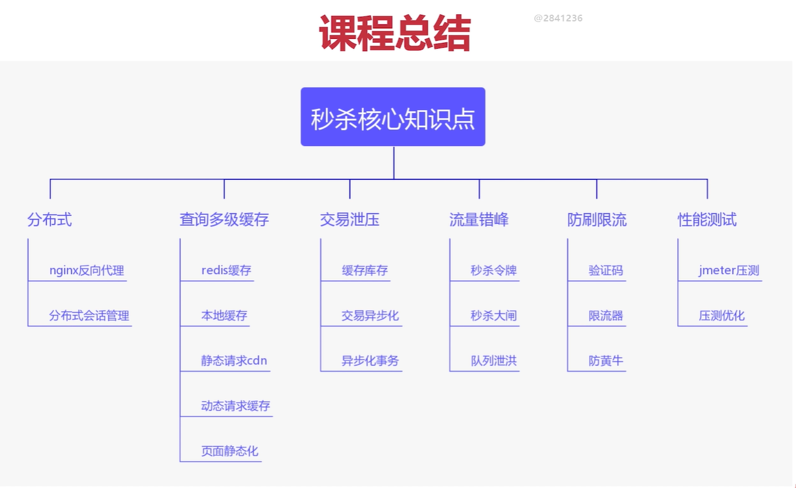
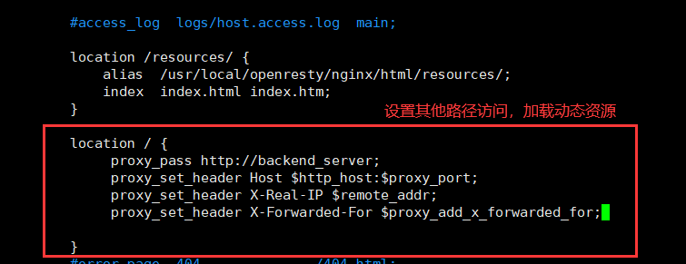

# 项目介绍

总体知识点：




## 一、项目背景介绍

在抢购等场景下，服务会收到很大的流量请求。此时如果这些流量完全交由业务服务从数据库查询再去响应，具有两大弊端：

1. 数据库连接过多导致崩溃
2. 响应迟缓，影响用户体验

解决办法：分布式扩展，使用多级缓存，流量削峰，防刷限流


## 二、分布式扩展

1、Nginx反向代理负载均衡

​	Nginx作用

- 可以做静态web服务器
- 可以做为动静分离服务器，将静态资源的请求直接处理，将动态的请求转发给相应后端服务，并以ajax的形式返回给前端
- 做反向代理服务器

Nginx配置

- 前端资源部署



当我们浏览器访问miaoshaserver/resources/…时，访问的是/usr/local/openresty/nginx/html/resources/目录下的静态资源文件，做到H5请求静态资源到nginx服务器

- 配置动静分离服务器


**添加其他路径访问,设置动态请求location为proxy pass 路径**：


使用Nginx作为反向代理服务器将后台服务器进行水平扩展，使用统一的域名进行访问，采用负载轮询的方式，Nginx由于其采用了epoll多路复用、master worker进程模型和协程机制保证了其高可用。

select/epoll 模型：一个服务器的进程可以监听多个文件描述符，一旦某个描述符就绪（读就绪或者写就绪），就通知程序进行相应的读写操作。select模型采用轮询的方式来查看描述符是否就绪，效率较低，而且最多支持1024个连接。epoll相对于select来说更加灵活，没有描述符限制，采用触发回调而不是轮询的方式来通知描述符就绪。


2、分布式会话管理

使用Nginx作为反向代理服务器将后台服务器进行水平扩展之后，可能用户登录之后每次路由请求因为分布式系统导致请求不到一个服务器上，这就可能导致用户每次都需要重新登录，为解决该问题，可以使用 Redis 将用户的 Session 进行集中管理，在这种模式下只要保证 Redis 是高可用和扩展性的，每次用户更新或查询登录信息都直接从 Redis 集中获取。

实现基于token的分布式会话实现：

​	首先生成一个登陆凭证token，建立token与用户登录态之间的联系，并设置到Redis里面。然后将token存入用户的cookie中，用户下次登陆时发送带有token的cookie请求，服务器就以token为key向Redis获取用户信息。


## 三、查询缓存

1. Redis缓存

浏览商品时先根据商品id到Redis里面获取，如果获取不到，就访问下游的service，然后将获取到的商品信息写入到Redis内。


2. JVM本地热点缓存

- 热点数据
- 脏读非常不敏感
- 内存可控

使用Guava cache组件，首先封装一个本地缓存操作类，实现存方法和取方法。查询商品信息时：先查询本地缓存->Redis缓存->数据库。


## 四、交易缓存

1. 交易验证优化

在开始交易后，要针对活动实时信息和用户实时信息进行验证，目的是为了风控策略，检查用户账号是否异常，**可以通过异步的方式先将用户模型写入缓存，在缓存中与实时信息做一致性检验，做到风控策略。**这样可以减小交易过程的响应时间。

在活动开始前半个小时发布活动，将库存同步到Redis内，对缓存进行预热。


2. 交易过程优化

采用异步消息队列的方式，将异步扣减库存的消息同步给消息的consumer端，并由消息的consumer端完成数据库扣减的操作，目的是为了削峰。

（1）活动发布同步库存进缓存

（2）下单交易减缓存库存

（3）异步消息扣减数据库库存

我们不追求强一致性，只需要保证最终结果的一致性。比如缓存中的库存和数据库中的库存可能会有不一致情况发生。

回顾整个下单流程，我们之前做了下单减缓存库存优化以及回补库存的操作，但是因为整个下单是属于一个transaction事务，如果用户下单成功，但是之后订单入库或返回前端的过程中失败，事务回滚，会导致少卖的现象，有可能造成库存堆积

我们的解决方法就是异步消息的发送要在整个事务提交成功后再发送

回调checkLocalTransaction函数时，无法仅仅通过itemId和amount来确定库存是否扣减成功，所有要引入**库存流水**的概念

操作流水的数据类型：

- 主业务数据：master data ，比如商品模型itemModel
- 操作型数据：log data

**首先，在OrderController先开启异步发送事务型消息的操作，在mqProducer中实现此异步扣减库存的方法，投递prepare消息。然后在mqProducer内部初始化方法中实现投递prepare事务型消息成功后，真正创建订单的操作，如果创建订单失败，则事务回滚，这条消息就不会被消费。Broker会一直对这条消息进行回查，一旦发现事务处理成功，就把这条消息设置为可见。RocketMQ不会无休止的进行事务状态回查，默认回查15次，如果15次回查还无法得知事务状态，默认rollback该消息**

**消息的内容**：`topickName`，`tags: increase` ，`body(itemId、amount、stockLogId)`


解决超卖问题：

设计原则：

宁可少卖，不能超卖

方案：

（1）将库存数据放到Redis里面，在Redis里面做库存预减，Redis中的库存可以比实际数据库少。数据库减库存的时候，先判断库存是否大于0，因为数据库的更新操作是加**行锁**串行化的(要先加上索引，否则会变成加**表锁**)，所以只需要在减库存的时候判断一下库存是否大于0就可以了。

（2）超时释放（针对消息一直卡死在初始状态，会造成订单大量废弃，设置超时时间）


## 五、流量削峰

由于秒杀下单的接口可能会被脚本不停的刷，造成系统压力过大。

1. 秒杀令牌

秒杀接口需要依靠令牌才能进入，下单前需要先获得秒杀令牌。如果获得令牌失败，抛出错误。

**生成令牌**

在秒杀活动模块生成秒杀令牌存入Redis并设置5分钟的过期时间，key为用户id、活动id以及商品id，value为UUID生成的Token。将用户风控策略与库存售罄判断前置到令牌发放中，先判断库存是否已经售罄，若对应的售罄key存在，则直接返回下单失败。秒杀活动模块对秒杀令牌生成全权处理。用户在点击验证时，会从Redis中获取令牌。

秒杀令牌以token的方式实现，与用户id、活动id以及商品id相关联 ，作为一个**单商品**的秒杀。

2. 秒杀大闸

为了防止秒杀令牌无限制生成，影响系统性能，设置一个以秒杀商品初始库存x倍数量作为秒杀大闸，存入Redis中，key为活动id，value为库存x倍数量。用户获取令牌时，先判断是否超出大闸数量，超出这个数量，就无法发放秒杀令牌。


### 队列泄洪

- 排队有些时候比并发更高效（例如redis单线程模型，innodb mutex key等）

- 依靠排队去限制并发流量
- 依靠排队和下游拥塞窗口程度调整队列释放流量大小


新建一个容量为20的线程池，作为一个拥塞窗口为20的等待队列，用来队列化泄洪，将下单的事务型消息提交到线程池操作。

## 六、防刷限流

1. 验证码技术

新建一个CodeUtil类实现生成验证码的功能，在生成秒杀令牌前验证用户输入验证码的正确性。

2. 使用令牌桶算法来进行限流

使用Guava中的`RateLimiter`来实现限流功能，可以控制流量并且可以应对突发流量。使用`RateLimiter`的`tryAcquire`方法，如果线程过了指定时间后仍然没有获取到令牌，就会返回false。

令牌桶算法的过程：

- 系统以恒定的速率产生令牌，然后将令牌放入令牌桶中
- 令牌桶有一个容量，当令牌桶满了的时候，再向其中放入的令牌就会被丢弃
- 每次一个请求过来，需要从令牌桶中获取一个令牌，假设有令牌，那么提供服务；假设没有令牌，拒绝服务


# RPC项目

**RPC：远程过程调用**

是一种进程间通信方式。允许程序调用另一个地址空间（通常是共享网络的另一台机器上）的过程或函数，而不用显式编码这个远程调用的细节。


## 一、项目概述

该项目实现了一个简易的RPC框架，通过该框架可以实现和Dubbo类似的远程服务调用功能。

项目主要分为三大模块：服务注册/服务发现模块，网络传输模块，Spring注解模块


## 二、服务注册/服务发现模块

采用Nacos作为注册中心

该模块主要有三个实现类

ServiceProviderImpl
NacosServiceDiscovery
NacosServiceRegistry

NacosServiceDiscovery和NacosServiceRegistry负责与Nacos交互，服务端注册服务到Nacos，客户端从Nacos获取服务

1. 服务注册

   ServiceProviderImpl中有一个使用ConcurrentHashMap实现的serviceMap，key为服务名，Object为服务实现类，用来保存服务名与提供服务的对象的对应关系

   服务注册的过程分为两步：

   1. 将服务地址注册到Nacos上
   2. 将服务实现类添加到serviceMap中

   第一步通过NacosFactory类获得NameService类，在Nacos上注册服务

   第二步将Service实现类put到serviceMap中就可以

2. 服务发现

   服务发现的整体过程分为

   1. 根据服务名到注册中心获取服务地址

      首先客户端从Nacos中获取到服务的地址和端口，并传入一个负载均衡策略(支持轮转和随机算法)，再创建Netty通道channel连接，如果是Socket方式，则将请求写入到输出流中

   2. 根据地址与服务方提供方建立连接，并发送服务请求

   3. 服务提供方根据请求到serviceMap中找到服务实现类，进行服务调用，并通过反射执行服务方法

   

## 三、网络传输模块

本项目支持Netty和Java原生Socket方式进行网络传输

主要包括：消息实体构建，解码/编码器，服务端，客户端

1. #### **消息实体构建**

   创建三个消息实体类：RpcRequest，RpcResponse

   **RpcRequest**对应服务调用请求，包含：请求ID+服务接口名+服务方法名+请求参数+请求参数类型+是否为心跳包

   **RpcResponse**对应服务调用响应，包含：请求ID+响应码+响应信息+**服务调用结果数据**

2. #### **解码/编码器**

   解码/编码器负责将RpcRequest/RpcResponse转换成字节进行网络传输，在接收时将字节重新构建为对象

   1）自定义协议

   ```java
   /*
   * +---------------+---------------+-----------------+-------------+
   * |  Magic Number |  Package Type | Serializer Type | Data Length |
   * |    4 bytes    |    4 bytes    |     4 bytes     |   4 bytes   |
   * +---------------+---------------+-----------------+-------------+
   * |                          Data Bytes                           |
   * |                   Length: ${Data Length}                      |
   * +---------------------------------------------------------------+
   */
   ```

   4字节的魔数，4字节的包类型，4字节的序列化类型，4字节的数据长度，Object类型的数据

   2）TCP粘包/半包问题

   自定义的解码器可以根据协议中的长度字段读取相应长度的字节，即整个数据包。从而解决了TCP粘包/半包问题。

   3）序列化/反序列化、

   - 在编码时将消息体进行序列化，然后压缩后传输
   - 解码时需要先对字节进行解压缩，然后反序列化得到对象

   实现了Json、Kryo、Hessian、Protostuf四种序列化方式

   Json序列化器：使用Java下的Jackson类库进行序列化，核心类为`ObjectMapper`，Jackson中的所有JSON操作都是在`ObjectMapper`中实现

   Hessian序列化器：调用`HessianOutput`和`HessianInput`进行序列化和反序列化

   Kryo序列化器：使用`Kryo`类进行序列化和反序列化

   Protobuf序列化器：使用`ProtostuffIOUtil`类进行序列化和反序列化

3. #### **服务端**

   服务端通过Netty的SeverBootstrap创建，并在pipeline中添加心跳处理器，解码/编码器，NettyServerHandler业务处理器

   NettyServerHandler业务处理器处理三大事件

   1. 异常事件：直接关闭连接
   2. 心跳事件：客户端每隔5s发送一次心跳ping，如果服务端持续30s没有收到心跳消息，说明连接可能失效，关闭连接
   3. 读事件：收到客户端请求，调用服务方法，返回调用结果

4. #### 客户端

   客户端主要实现服务调用请求的发送和请求结果的接收

   客户端通过Bootstrap创建，在pipeline中添加心跳处理器，编码解码器，NettyRpcClientHandler业务处理器

   1）发送服务调用请求

   步骤：

   1. 根据服务名获取服务提供方的地址
   2. 根据地址创建与服务端的连接
   3. 构建RpcRequest并通过该连接发送

   2）请求结果的接收

通过CompletableFuture异步获取请求

步骤：

1. 为每个请求创建一个`CompletableFuture<RpcResponse>`
2. 用一个Map保存已发送且未收到回复的请求（key为requestId，value为该请求的`CompletableFuture<RpcResponse>`）
3. 通过上述发送请求时，在该Map中存入该请求的`CompletableFuture<RpcResponse>`，且方法返回该Future
4. NettyRpcClientHandler收到服务器返回的调用结果后，从Map中移除该`CompletableFuture<RpcResponse>`，并为该Future设置好调用结果
5. 这样调用方就可以通过`CompletableFuture.get()`获取到调用结果了（如果未设置结果则一直阻塞）


### 为什么用Nacos作为注册中心

从CAP角度来看

首先，服务注册中心是为了服务间调用服务的，那么绝对不允许因为服务注册中心出现了问题而导致服务间的调用出问题。

 假如有node1,node2,node3,集群节点。 保存着可用服务列表ip1，ip2，ip3，试想如果此时不一致，比如node1只保存了ip1,ip2，此时服务读取node1的节点，调用node1的服务，顶多就是负载均衡时不会有流量打到ip3， 然后等 node1同步回ip3后，又一致了，这对服务其实没什么太大影响。

所以，推出服务注册中心应该是个AP系统。zookeeper是个CP系统，强一致性。Nacos是CP+AP系统

